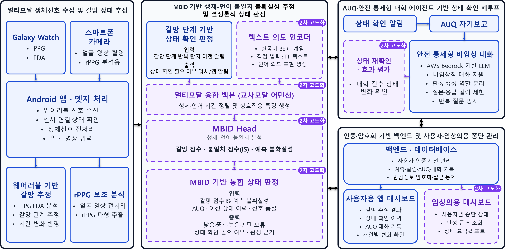

# NeuroTruth

## 진행 상황

| 항목 | 상태 |
|---|---|
| 워치·Android 앱·분석 서버·대화 백엔드 통합 | 시제품 구현 및 시연 |
| MBID·IS·불확실성 추정 | 학습·통합·성능 평가 예정 |
| 임상의용 기능과 위기 대응 경로 | 설계 및 후속 구현 예정 |
| 협력기관 파일럿 | 후속 검증 계획 |
| 소스 코드·환경 설정·설치 가이드 | 공개 — [개발 및 실행 안내](docs/DEVELOPMENT.md) |
| 시연 영상 | 공개 예정 |

**PPG·EDA 갈망 추정과 근거 기반 대화를 연결하는 알코올 사용장애 지원 시제품**

2026 인공지능 챔피언 일반 트랙 본선. 2026년 7월 시제품 평가 완료.

## 시스템 구조

*점선 및 ‘고도화’ 표시는 후속 개발 범위다.*

| 구성 | 현재 구현 | 후속 개발 |
|---|---|---|
| 웨어러블 | Galaxy Watch PPG·EDA 연동 및 갈망 단계 추정 | 신호 품질 제어와 일상환경 검증 |
| 카메라 | 얼굴 영상 전송, 서버 rPPG 분석, 결과 반환 | 움직임 구간 선별과 온디바이스 경량화 |
| 상태 확인 | 규칙 기반 판정, 워치·앱 알림, AUQ 연계 | 알림 빈도·임계값 최적화 |
| 대화 | AWS Bedrock LLM, 선택형 한국어 STT, Android TTS | 생체 근거와 불확실성 활용 고도화 |
| 기록 | 예측·알림·AUQ·대화의 세션 연결, 사용자 대시보드 | 임상의용 종단 요약과 대시보드 |
| MBID | 최종 목표로 설계 | 생체–언어 불일치 점수(IS), 예측 불확실성의 학습·통합·정량 검증 |

위험 판정은 결정론적 백엔드가 담당하고, LLM은 제공된 상태와 근거를 바탕으로 대화·요약을 생성한다. MBID의 성능과 임상적 유효성은 현재 결과에 포함되지 않는다.

## 평가 결과

피험자 독립 교차검증과 통합 기능 시험 결과.

| 평가 | 조건 | 결과 |
|---|---|---|
| PPG·EDA 갈망 단계 추정 | Leave-one-subject-out 교차검증 | Balanced accuracy 71%; macro-F1 70% |
| 통합 흐름 | MBID를 제외한 동일 시나리오 21회 반복 | 21/21 성공 |
| 상태 확인 알림 지연 | 동일 Wi-Fi 환경 | 평균 78 ms; P95 89 ms |
| 상태 확인 알림 지연 | LTE 환경 | 평균 121.1 ms; P95 133 ms |
| 카메라 rPPG 보조 분석 | 정적 조건, 20초 영상 10건 | 유효 결과 10/10; 평균 분석 시간 14.8초 |

통합 성공률은 센싱 → 갈망 추정 → 알림 → AUQ → 대화 → 대시보드 기록의 기능 시험 결과다. rPPG 결과 산출률과 분석 시간은 기준 심박 대비 정확도를 측정한 값이 아니다. 실제 환자 대상 임상·일상환경 유효성 검증은 후속 단계다.

## 소스 코드

| 경로 | 구성 |
|---|---|
| [apps/backend](apps/backend) | FastAPI API, 인증·암호화 저장, 생체신호 추론, 대화·리포트 |
| [apps/mobile](apps/mobile) | Android 앱 및 Wear OS 센서 연동 |
| [apps/web](apps/web) | 관리자용 React 웹 콘솔 |
| [apps/db](apps/db) | PostgreSQL·Docker Compose 및 스키마 초기화 |
| [apps/stt-service](apps/stt-service) | 한국어 음성 인식 서비스 |
| [apps/test_mobile_app](apps/test_mobile_app) | 센서·통신 검증용 Android/Wear OS 앱 |
| [docs](docs) | 설치·실행·배포 안내 및 설계 문서 |

설치, 환경 변수, 모델 설정과 검증 명령은 [개발 및 실행 안내](docs/DEVELOPMENT.md)에 정리되어 있다. 위 평가 표는 2026년 7월 시제품의 평가 결과다. 코드에 포함된 후속 구현의 별도 성능 검증을 의미하지 않는다.
