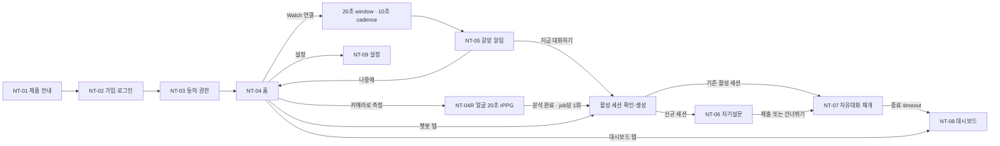
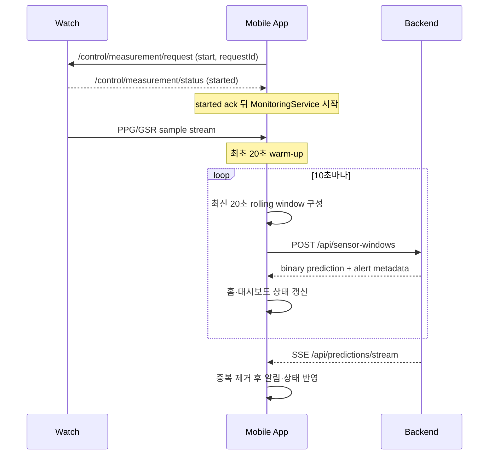

# PRD: NeuroTruth 모바일 앱 (신규 · V22 기준)

최종 업데이트: 2026-07-21
문서 소유: 모바일 프론트엔드
대상 코드베이스: `apps/mobile`

영어 원본: [PRD_neurotruth_mobile.md](PRD_neurotruth_mobile.md)

## 0. 문서 위상과 기준 자료

이 문서는 `apps/mobile`에 새로 만드는 환자용 모바일 앱의 제품 요구사항 정의서입니다. 플랫폼 PRD(`docs/prd/PRD_neurotruth.ko.md`)가 시스템 전체 범위를 정의한다면, 이 문서는 그중 **환자가 손에 들고 쓰는 앱 표면만** 화면 단위로 확정합니다.

| 자료 | 역할 | 충돌 시 우선순위 |
|---|---|---|
| 실행 중인 백엔드의 `/openapi.json` | 등록된 route·method·요청 스키마의 기계 판정 기준 | 1 |
| `apps/test_mobile_app/SERVER_API_SPEC.md` | 응답 payload와 계약 상세의 문서 기준 | 2 |
| `neurotruth_frontend_handoff_final/neurotruth_frontend_handoff_final.md` | 화면 동작·문구 계약 | 3 |
| 이 PRD | 범위·우선순위·인수 기준 | 4 |
| `neurotruth_app_design_handoff_final.pptx` | 화면 레이아웃 시각 참조 | 5 |

PPT 13~17페이지는 **현재 Kotlin 테스트 앱의 실제 구현 스크린샷**이며 목표 화면이 아닙니다. 동작이나 문구가 PPT와 위 문서들 사이에서 충돌하면 문서를 따릅니다.

기존 `apps/test_mobile_app`은 폐기 대상이 아니라 **참조 구현이자 계약 검증용 테스트 앱**입니다. 신규 앱은 이 앱이 이미 통과시킨 계약(인증 재시도, 센서 idempotency, rPPG job 복구, AUQ 스케일)을 그대로 만족해야 합니다.

---

## 1. 제품 정의

### 1.1 한 줄 정의

NeuroTruth 모바일 앱은 CBT 치료 중이거나 치료 의지가 있는 사용자가, 갈망이 올라오는 순간을 **기록하고 곧바로 대화로 연결**할 수 있게 하는 연구용 보조 앱입니다.

### 1.2 해결하려는 문제

갈망은 진료실 밖에서, 예약된 시간이 아닌 때에 발생합니다. 사용자는 그 순간을 지나간 뒤에야 떠올리고, 임상가는 사후 회상에만 의존하게 됩니다. 이 앱은 웨어러블 생체신호 또는 얼굴 rPPG로 그 순간의 정황을 남기고, 같은 순간에 대화를 제안합니다.

### 1.3 목표

- 갈망 가능성이 올라간 시점을 **알림 → 대화**로 30초 안에 연결한다.
- Watch가 없거나 연결되지 않은 사용자도 **얼굴 20초 측정**이라는 동등한 진입 경로를 갖는다.
- 자기보고(AUQ)를 강제하지 않으면서도, 응답한 경우 대화와 대시보드에 연결한다.
- 모든 측정·대화·자기보고를 사용자 본인이 대시보드에서 되돌아볼 수 있게 한다.
- 앱이 죽거나 재시작해도 진행 중인 대화 세션과 rPPG job을 **중복 생성 없이** 복구한다.

### 1.4 비목표

- 진단, 치료 효과, 임상적 위험도 판정, 응급 대응, 자동 신고·연락.
- 백그라운드·연속 카메라 측정, 자동 반복 rPPG.
- 앱에서의 LLM 직접 호출, DGX 주소 노출, 모델 파라미터 조작.
- 임상가용 실시간 모니터링 화면, 관리자 기능(웹 콘솔 전용).
- 데이터 export, 리포트 원문 열람, bulk download.
- 갈망 점수의 임의 cutoff 생성(낮음/중간/높음 같은 자체 등급).

### 1.5 대상 사용자

| 구분 | 설명 | 앱에서의 함의 |
|---|---|---|
| 주 사용자 | CBT 치료 중이거나 치료 의지가 있는 성인 환자 | 낙인·판정 어휘 금지, 큰 글자·단순 동선 |
| Watch 보유자 | Galaxy Watch 연동 | Phone에서 시작하는 지속 측정, 알림 중심 흐름 |
| Watch 미보유자 | 스마트폰만 사용 | 얼굴 20초 측정이 주 측정 경로 |
| 간접 이해관계자 | 연구자·임상가 | 앱에 화면 없음, 웹 콘솔로만 접근 |

---

## 2. 기술 스택 결정

### 2.1 권고: Kotlin + Jetpack Compose 네이티브 Android

**권고 근거.** 이 앱의 핵심 기능 네 가지가 모두 Android 네이티브 표면에 강하게 묶여 있습니다.

| 기능 | 의존 | 크로스플랫폼 시 비용 |
|---|---|---|
| Watch 연동 | Wear Data Layer, Samsung Health Sensor API (`samsung-health-sensor-api-1.4.1.aar`) | 네이티브 모듈 자체 구현 필요, 대안 없음 |
| 20초 rPPG 촬영 | CameraX 1.4.0 + ML Kit Face Detection 16.1.7, 프레임 타이밍 정확도 | 브리지 오버헤드가 촬영 길이 계약(19500~20500ms)을 위협 |
| TTS | Android `TextToSpeech` (서버 TTS 없음) | 래핑 가능하나 이득 없음 |
| 16KB 페이지 정렬 | AGP 8.5.2 / Gradle 8.7 기준 ELF·zip 정렬 검증 | 서드파티 네이티브 라이브러리 정렬 검증 부담 증가 |

iOS 출시는 현재 로드맵에 없고(플랫폼 PRD의 대상은 Android), 참조 구현이 이미 Kotlin이며 계약 테스트도 JVM unit test로 존재합니다. React Native를 택하면 위 4개 모두에 네이티브 모듈을 직접 써야 하므로, 크로스플랫폼의 이득 없이 브리지 리스크만 추가됩니다.

**따라서 신규 앱은 Kotlin + Compose 단일 모듈 구조로 시작합니다.** 이 결정을 뒤집으려면 iOS 출시 요구가 확정되어야 하며, 그 경우에도 Watch·rPPG 경로는 Android 네이티브로 남기는 하이브리드를 권합니다.

### 2.2 모듈·아키텍처 기준선

```text
apps/mobile
  app/          Phone 앱 (Compose UI, ViewModel, API client, 로컬 저장)
  wearos/       Wear OS relay (센서 수집·전송, 알림 표시 전용)
```

- UI는 Compose, 상태는 ViewModel의 `StateFlow`로 노출합니다. 화면은 상태를 소비만 하고 비즈니스 분기를 갖지 않습니다.
- 네트워크 계층은 **인증 인터셉터를 통과하는 단일 클라이언트**로 통일합니다. 401 처리(1회 refresh + 원 요청 1회 재시도)를 각 화면이 개별 구현하지 않습니다.
- 세션 진입은 `ensureSession()` **단일 함수**로 통일합니다(§5.3).
- 참조 구현의 검증된 정책 클래스(예: `AlertActionPolicy`, `ChatRetryPolicy`, `StableClientWindowIdStore`, `RppgFaceStabilityTracker`)는 로직과 테스트를 함께 이식합니다.

### 2.3 빌드 기준

| 항목 | 값 | 근거 |
|---|---|---|
| AGP | 8.5.2 | 16KB 페이지 정렬 baseline |
| Gradle | 8.7 | 동일 |
| Kotlin | 1.9.22 | 참조 구현과 동일 |
| Compose compiler extension | 1.5.8 | Kotlin 1.9.22와 짝을 이루는 필수 버전 |
| Compose BOM | 2024.02.00 | 동일 |
| compileSdk / targetSdk | 35 | 16KB 페이지와 Android 15 FGS 규칙 |
| minSdk | 26 (phone), 30 (wearos) | 참조 구현과 동일 |
| JVM target | 17 | 로컬 toolchain이 JDK 21이며, 참조 앱의 1.8은 레거시 |
| CameraX | 1.4.0 | rPPG 촬영 |
| ML Kit Face Detection | 16.1.7 | 얼굴 안정화 판정 |
| Play Services Wearable | 18.1.0 | Data Layer |
| 릴리스 검증 | APK zip 정렬 + ELF 정렬 검증 필수 | 16KB 기기 대응 |

로컬에는 `~/Library/Android/sdk/platforms/android-32`와 `android-33`만 설치되어 있으므로, `compileSdk 35`는 첫 빌드 전에 SDK 다운로드가 필요합니다. `gradle.properties`에는 `org.gradle.java.home` 경로를 두지 않습니다. 참조 앱은 Windows JDK 경로를 하드코딩하고 있어 macOS와 CI에서 빌드가 깨집니다.

### 2.4 포그라운드 서비스

10초 센서 cadence와 SSE 연결은 화면이 꺼진 상태에서도 유지되어야 하는 P0 요구사항이므로, ViewModel scope가 아니라 포그라운드 서비스에서 실행합니다.

| 항목 | 값 |
|---|---|
| FGS type | `health` (Wear 쪽과 동일) |
| 권한 | `FOREGROUND_SERVICE`, `FOREGROUND_SERVICE_HEALTH`, `POST_NOTIFICATIONS`, 필요 시 `HIGH_SAMPLING_RATE_SENSORS` |
| 알림 채널 | 낮은 중요도, 무음. 문구는 측정 중이라는 사실만 알리고 갈망 값을 담지 않음 |
| 시작 조건 | `biosignal` 동의 허용 + Phone 사용자 시작 요청 + Watch `started` ack |
| 중지 조건 | Watch 연결 해제, 동의 철회, 로그아웃 |
| 부팅 후 자동 재시작 | P0 범위 아님 — 사용자가 앱을 다시 엽니다 |

사용자가 `POST_NOTIFICATIONS`를 회수하면 서비스가 알림을 띄울 수 없어 실행 자체가 불가능합니다. 이를 감지해 측정이 중지되었음을 홈 배너로 안내하고, 조용히 실패하지 않습니다.

---

## 3. 정보 구조와 내비게이션

### 3.1 전체 흐름



### 3.2 하단 탭

| 탭 | 목적 | 탭 전환 후에도 유지할 상태 |
|---|---|---|
| 홈 | 프로필 요약, 현재 갈망 상태, Watch 연결, 얼굴 측정 진입 | 마지막 갈망 상태, Watch 상태 |
| 대시보드 | 최근 1시간·오늘·7일·30일 기록 | 선택한 날짜와 기간 |
| 챗봇 | 활성 대화 재개 또는 새 자유대화 | 활성 `sessionId`, 미전송 입력문 |

**탭은 정확히 3개입니다.** 프로필은 독립 탭이 아니며 홈 우측 상단 설정에서 진입합니다. 인증 완료 전(NT-01~NT-03)에는 하단 탭을 표시하지 않습니다.

### 3.3 화면 목록

| ID | 화면 | 진입 | 우선순위 |
|---|---|---|---|
| NT-01 | 제품 안내 | 최초 실행, 안내 버전 변경, 설정 | P0 |
| NT-02 | 가입·로그인 | NT-01 이후, 로그아웃 후 | P0 |
| NT-03 | 동의·권한 | 가입 흐름, 설정 | P0 |
| NT-04 | 홈 | 인증 완료 후 기본 | P0 |
| NT-04R | 얼굴 rPPG 측정 | 홈의 `카메라로 측정` | P1 |
| NT-05 | 갈망 알림 | 시스템 알림·팝업 | P0 |
| NT-06 | 자기설문(AUQ) | 신규 세션 생성 시 | P1 |
| NT-07 | AI 챗봇 | 알림·챗봇 탭·rPPG 완료 | P0 |
| NT-08 | 대시보드 | 하단 탭, 대화 종료 후 | P1 |
| NT-09 | 설정 | 홈 우측 상단 | P1 |

---

## 4. 화면별 요구사항

### NT-01 · 제품 안내

**목적.** 이 앱이 무엇이고 무엇이 아닌지를 사용자가 계정을 만들기 전에 이해하게 합니다.

**구성.**
- 제품 한 줄 정의: 갈망 상황을 기록하고 대화를 돕는 연구용 보조 시스템
- 대상: 치료 중이거나 치료 의지가 있고, 갈망 상황에서 지속적인 기록과 대화 지원이 필요한 사용자
- 한계 고지(시각적으로 구분된 강조 블록): 의료행위·진단·처방·응급 대응을 대체하지 않음
- 하단 고정 버튼 `[확인하고 계속]` → NT-02

**동작.**
- 최초 실행 또는 안내 버전 변경 시 표시합니다.
- 확인한 안내 버전을 기기에 저장하고, 설정에서 언제든 다시 볼 수 있습니다.
- 뒤로가기로 건너뛸 수 없습니다.

**인수 기준.** 앱을 처음 설치한 사용자가 NT-01을 보지 않고 NT-02에 도달할 수 없다. 안내 버전이 올라가면 다음 실행에서 다시 표시된다.

---

### NT-02 · 가입·로그인

**목적.** 사용자가 직접 계정을 만들고 진입합니다. 관리자 초대나 코드 발급 없이 자기 주도 가입입니다.

**구성.** 표시명(선택), 이메일, 비밀번호, 비밀번호 확인, `[가입하고 시작]`, `[기존 계정으로 로그인]`.

표시명은 NT-04 홈의 프로필 요약에 노출되는 값입니다. 이 화면에 입력 경로가 없으면 모든 사용자에게 null이 되므로, 가입 시점에 받아(signup body의 `name`으로 전송) NT-09에서 `PATCH /api/me`로 수정할 수 있게 합니다. 값이 없으면 홈은 이메일의 local part로 대체 표시합니다.

**동작.**
- 신규 사용자는 이 화면에서 계정 정보를 입력한 뒤 **NT-03으로 이동만** 합니다. 이 시점에 서버 호출은 없습니다.
- 입력한 비밀번호는 화면 흐름 동안 **메모리에만** 유지합니다. 디스크·로그·크래시 리포트에 남기지 않습니다.
- 실제 가입은 NT-03에서 동의 스냅샷과 함께 `POST /api/auth/patient/signup` 한 번으로 완료합니다. 현재 서버는 signup 요청에 consent를 요구합니다.
- 비밀번호는 12자 이상입니다(서버 계약). 클라이언트에서 미리 검증해 왕복을 줄입니다.
- 기존 계정 로그인은 `POST /api/auth/login` 후 `GET /api/me`로 최신 동의를 확인하고, 필수 동의가 충족되면 홈으로, 아니면 NT-03으로 보냅니다.

**토큰 정책.**
- access token 기본 15분, refresh token 불투명 30일이며 매 refresh마다 회전합니다.
- 401 발생 시 **refresh 1회 → 원 요청 1회 재시도**까지만 수행합니다.
- refresh 실패 시 진행 중인 녹음·TTS·polling·센서 업로드를 모두 정리한 뒤 로그인 화면으로 이동합니다.
- refresh token은 Android Keystore 기반 저장소에만 보관합니다.

**인수 기준.** 만료된 access token으로 임의 화면을 열면 사용자가 아무 조작 없이 화면이 정상 로드된다. refresh까지 실패하면 로그인 화면으로 나가며, 이때 백그라운드 센서 업로드가 남아 있지 않다.

---

### NT-03 · 동의·권한

**목적.** 필수 동의를 받고, 선택 기능을 사용자가 개별적으로 끌 수 있게 합니다.

**필수 동의(3종, 모두 필수).** 이용약관 `tos`, 개인정보 `privacy`, 민감정보 `sensitive`.

**선택 동의와 기능 게이트.**

| 선택 동의 | 키 | 켜졌을 때 | 꺼졌을 때 |
|---|---|---|---|
| 생체신호 | `biosignal` | Watch PPG/GSR 수집·전송 | Watch 측정 비활성 |
| AI 분석 | `aiAnalysis` | 갈망 모델 추론, 세션 대화 | 센서 저장만, 갈망 결과 미표시 |
| 알림 | `notification` | 갈망 알림·대화 제안 표시 | 결과는 기록하되 알림 미표시 |
| 음성 | `voice` | STT 입력 | 텍스트 입력만 제공 |
| 얼굴 rPPG | `cameraRppg` | 얼굴 측정 기능 | `카메라로 측정` 비활성 + 사유 안내 |
| 얼굴 영상 보존 | `faceVideoRetention` | rPPG 영상 업로드·서버 보존 | 얼굴 측정 시작 차단 |
| 리포트 생성 | `reportGeneration` | 세션 리포트 생성 | 리포트 미생성 |

- 카메라 rPPG는 `biosignal` + `aiAnalysis` + `cameraRppg` + `faceVideoRetention` **4종이 모두** 필요합니다.
- `notification=false`는 알림 표시만 막습니다. 사용자가 직접 챗봇이나 AUQ를 여는 것은 막지 않습니다.
- 동의 변경은 덮어쓰기가 아니라 **불변 스냅샷 추가**(`POST /api/me/consents`)입니다. 철회는 신규 처리를 막을 뿐 과거 데이터를 삭제하지 않으며, 이 사실을 화면에서 명시합니다.

#### 동의 버전 문자열(서버 필수)

`POST /api/auth/patient/signup`과 `POST /api/me/consents`는 consent 객체에 10개 boolean과 함께 비어 있지 않은 버전 문자열 3종을 **필수로** 요구합니다.

| 필드 | 값 | 출처 |
|---|---|---|
| `tosVersion` | `"1.0"` | 앱 상수, 릴리스에 포함 |
| `privacyVersion` | `"1.0"` | 앱 상수, 릴리스에 포함 |
| `consentFormVersion` | `"1.0"` | 앱 상수, 릴리스에 포함 |

하나라도 누락하면 스키마 검증에서 실패해 가입 자체가 실패합니다. **현재 요구되는 버전을 알려주는 엔드포인트는 없습니다** — `GET /api/me`는 저장된 스냅샷만 돌려줍니다 — 따라서 이 값들은 앱의 컴파일 타임 상수이며, NT-01 안내 버전 옆에 한곳으로 모아 선언합니다.

이 값들은 기기에만 저장되고 서버로 나가지 않는 NT-01 확인 안내 버전과는 별개입니다.

**버전 상향 시 재동의.** 로그인 후 저장된 스냅샷의 버전 문자열 3종을 앱 상수와 비교합니다. 하나라도 다르면 홈으로 바로 보내지 않고 NT-03으로 보내 재동의(`POST /api/me/consents`)를 받습니다. "필수 동의 충족"을 단순히 `tos && privacy && sensitive == true`로만 판정하면 정책이 바뀌어도 낡은 동의가 조용히 유지됩니다.

**기기 권한.** 동의와 OS 권한은 분리합니다. 이 화면에서는 동의만 저장하고, **마이크·카메라 권한은 해당 기능을 처음 열 때** 요청합니다. 알림 권한(`POST_NOTIFICATIONS`)은 알림 동의를 켰을 때 요청합니다.

**동작.** `[저장하고 홈으로]` → (신규) signup 호출 + 동의 스냅샷 전송 → 홈. (기존 계정) `POST /api/me/consents` → 홈.

**인수 기준.** 선택 동의를 모두 끈 상태로 가입해도 앱은 정상 동작하며, 각 비활성 기능은 "왜 비활성인지와 어디서 켜는지"를 화면에서 안내한다.

---

### NT-04 · 홈

**목적.** 지금 상태를 한눈에 보여주고, 다음 행동(측정·대화·기록)으로 보냅니다.

**구성은 3개 영역으로 제한합니다.**

1. **프로필 요약** — 표시명, 계정 요약, 우측 상단 `설정`
2. **갈망 상태 카드** — 4단계 문구, 안내 문구, 우측 하단에 측정 시각·측정 기기
3. **Watch 상태 및 측정 제어** — 연결 상태, `[측정 시작/중지]`, 연결 중 비활성인 `[카메라로 측정]`

**홈에 넣지 않는 것.** PPG 파형, 원시 신호, 서버 상태, 권한 확인 버튼, 개발자 버튼, 정확한 확률 퍼센트. 원시 신호와 상세 그래프는 대시보드에서만 봅니다.

**개발자 진입.** 실기기 테스트 화면은 **홈 프로필 헤더 2.5초 롱프레스**라는 숨겨진 경로로만 유지하며, 일반 사용자 화면에는 어떤 단서도 노출하지 않습니다.

#### 갈망 4단계 표시 규칙

| `cravingProbability` | `stageCounts` key (대시보드 전용) | 단계 | 사용자 표시 문장 |
|---:|---|---|---|
| `0.00 ≤ p < 0.25` | `low` | 안정 | 아무 문제 없어요! |
| `0.25 ≤ p < 0.50` | `observe` | 관찰 | 관찰이 필요해요, 심각하진 않아요! |
| `0.50 ≤ p < 0.75` | `caution` | 주의 | 주의가 필요해요, 술이 드시고 싶으신가요? |
| `0.75 ≤ p ≤ 1.00` | `high` | 위험 | 갈망이 높게 감지됐어요. 챗봇과 대화를 시작할까요? |

**단계는 `cravingProbability` 하나만으로 클라이언트에서 계산합니다.** `class`, `classCode`, `classProbabilities`에서 유도하면 안 됩니다. 이들은 **이진** 분류기의 출력이라 p ≥ 0.5이면 `classCode`가 이미 `"high"`입니다. 단계를 `classCode`에 묶으면 p ≥ 0.5인 모든 값이 위험으로 표시되어 주의 구간 전체가 틀립니다. 위 표의 `low|observe|caution|high` 키는 `GET /api/me/craving-dashboard`와 calendar 응답의 `stageCounts` 키로만 존재합니다. `p = 0.60 → 주의`를 unit test로 고정합니다.

- 이 4단계는 **연구 화면 표시 규칙이지 임상 위험도나 진단 cutoff가 아닙니다.** 카드에 이 취지의 문구를 함께 둡니다.
- 정확한 퍼센트를 크게 노출하지 않습니다.
- 서버 응답에 persisted `alertId`와 `alertAction=required_intervention`이 있으면 단계 문구와 **별도로** `대화 권장`을 표시합니다.
- 측정값이 없으면 0%나 "낮음"으로 표시하지 않고 **측정 데이터 없음**으로 표시합니다.

#### 최신 상태 결정 규칙

- 최신 상태는 `timestampMs`로 비교합니다.
- 늦게 도착한 과거 카메라 결과가 더 최신인 Watch 결과를 덮어쓰지 않습니다.
- `timestampMs`가 동일하면 Watch(`source=watch_sensor`)를 우선합니다.
- 카메라 결과(`source=camera_rppg`)는 홈 최신 상태와 별개로 **대시보드 이력에는 항상 유지**합니다.
- 표기 형식: 실시간 Watch 값은 `실시간 · Watch`, 저장된 값은 `YYYY-MM-DD HH:mm · Watch|카메라`.

#### Watch 연결 상태별 측정 동작

| Watch 상태 | 홈 동작 |
|---|---|
| 연결됨 | Watch 모니터링이 기본 측정. `[카메라로 측정]` **비활성**, "Watch 연결을 해제해야 사용할 수 있습니다" 안내 |
| 연결 안 됨(확정) | rPPG 동의 4종 + 카메라 권한 + 서버 ready가 모두 충족되면 `[카메라로 측정]`을 **주 동작으로 활성화** |
| 확인 중 · 오류 | 미연결로 **추정하지 않고** 카메라 버튼 비활성, 상태 확인 안내 표시 |

연결 판정은 Wear Data Layer의 connected-node 목록을 클라이언트에서 확인합니다. 목록이 비었다는 것이 **확정된 경우에만** 미연결로 간주합니다. 이 판정은 API 필드를 추가하지 않습니다.

**인수 기준.** Watch 연결 중에는 카메라 버튼이 눌리지 않으며 사유가 보인다. 연결 확인 중 상태에서 카메라 버튼이 활성화되지 않는다. 카메라로 측정한 뒤 Watch 예측이 도착하면 홈 최신 상태만 Watch로 바뀌고 대시보드의 카메라 이력은 남는다.

---

### NT-04R · 얼굴 20초 rPPG 측정

**목적.** Watch가 없는 사용자에게 동등한 측정 경로를 제공하고, 측정 직후 대화로 연결합니다.

**진입 조건(모두 충족).**
- 동의 4종: `biosignal`, `aiAnalysis`, `cameraRppg`, `faceVideoRetention`
- 카메라 권한 허용
- `GET /api/rppg/status`의 `enabled`, `available`, `modelLoaded`가 모두 준비 → 화면에서 `ready`로 해석
- Watch가 확정 미연결

**촬영 상태 머신.**

```text
준비 → 얼굴 찾기 → 안정화 → 20초 촬영 → 업로드 → 분석 대기 → 완료 | 재촬영 | 실패
```

- 전면 카메라를 사용합니다.
- 한 얼굴이 안내 영역에서 **1초 유지**되면 자동으로 촬영을 시작합니다.
- 촬영 중 얼굴이 **1초 이상** 안내 영역을 벗어나거나 앱이 백그라운드로 가면 촬영을 취소합니다.
- 화면에는 남은 시간과 진행 바를 표시하고, 하단에 "얼굴 영상은 서버에서 암호화되어 관리자가 삭제할 때까지 보존됩니다"를 고지합니다.

**업로드 계약.**
- MP4, `durationMs`는 `19500..20500`, 기본 최대 40 MiB.
- `POST /api/rppg/jobs` 멀티파트: `video`, `clientCaptureId`, `capturedAtMs`, `durationMs`, 선택 `sessionId`.
- HTTP 202 수신 **직후 로컬 MP4를 삭제**하고 `jobId`, `captureId`, `clientCaptureId`만 복구용으로 저장합니다.
- 같은 `clientCaptureId` + 동일 영상 재시도는 기존 job의 현재 상태와 함께 202를 돌려줍니다.

**job 상태 처리.**

| 상태 | 앱 동작 |
|---|---|
| `queued` / `running` | 2초마다 polling, 분석 대기 화면 표시(아래 상한 참조) |
| `completed` | 결과 저장 → `ensureSession()` → 챗봇 이동 (**job당 1회만**) |
| `retry_required` (품질 미달) | 같은 job 재시도가 아니라 **새 촬영** |
| `failed` + `retryAllowed=true` | `POST /api/rppg/jobs/{id}/retry`로 재분석 |
| `failed` + `retryAllowed=false` | 사유 안내 후 홈 복귀 |

**Polling 주기.** `GET /api/rppg/jobs/{jobId}`를 2초마다 호출합니다. **3분** 동안 terminal 상태가 오지 않으면 전면 스피너를 멈추고 "분석이 예상보다 오래 걸리고 있어요 — 완료되면 알려드릴게요" 상태와 `[홈으로]` 동작을 제공한 뒤, 30초 간격 백그라운드 확인으로 전환합니다. 이렇게 해야 `running`에서 빠져나오지 못하는 job의 스피너 노출과 배터리 소모가 모두 제한됩니다. 통신 오류는 terminal 상태가 아니므로 같은 2초 주기로 재시도하고, 3분 상한이 이를 처리하게 둡니다.

- 앱을 재시작해도 terminal 상태가 아니면 polling을 재개합니다.
- 완료 이벤트를 여러 번 받아도 **세션 생성과 화면 이동은 정확히 한 번**만 수행합니다(route-once 클레임).
- 앱은 DGX를 직접 호출하거나 주소를 노출하지 않고 NeuroTruth 백엔드만 호출합니다.

**인수 기준.** 촬영 완료 후 앱을 강제 종료하고 다시 열어도 job이 새로 생성되지 않고 기존 job의 결과를 이어받는다. 완료 이벤트가 중복 도착해도 챗봇 화면이 두 번 열리지 않는다. 202 이후 기기 저장소에 MP4가 남지 않는다.

---

### NT-05 · 갈망 알림

**목적.** 확정 판정이 아니라 **대화 제안**을 전달합니다.

**동작.**
- 앱 내부 카드가 아니라 **휴대폰 시스템 알림 또는 팝업**으로 표시합니다.
- 문구는 진단·확정처럼 말하지 않습니다. 예: "갈망 가능성이 높아진 것으로 보여요 / 지금 상황을 편하게 이야기해 볼까요?"
- 액션은 두 개입니다. `[지금 대화하기]` → `ensureSession()`, `[나중에]` → 세션을 만들지 않고 현재 화면 유지.
- 같은 `alertId`로 중복 알림을 만들지 않습니다.
- Watch는 서버가 준 `alertAction`/`alertLevel`을 따르며, class가 1이라는 이유만으로 자체 알림을 만들지 않습니다.
- `notification` 동의가 꺼져 있으면 알림을 표시하지 않되 결과는 정상 기록합니다.
- `source=watch_sensor`에서 `p≥0.75`가 **3회 연속**이고 각 간격이 20초 이하여야 서버가 알림을 만듭니다. 낮은 단계나 긴 공백은 streak를 초기화합니다.
- 한 번 생성되면 환자 단위로 **900초** 동안 추가 Watch 알림을 억제합니다. Phone과 Watch는 같은 persisted `alertId`를 각각 중복 제거합니다.
- `source=camera_rppg` 결과는 상태·이력·챗봇 흐름에는 남지만 알림 생성 대상이 아닙니다.

**인수 기준.** 같은 alert가 SSE와 업로드 응답 양쪽으로 들어와도 알림은 1회만 뜬다. `나중에`를 눌렀을 때 서버에 세션이 생성되지 않는다.

---

### NT-06 · 자기설문 (AUQ)

**목적.** 그 순간의 자기보고를 남기되, **대화를 막지 않습니다.**

**표시.**
- 8문항, 한 화면에 한 문항, 상단에 `1 / 8` 진행 표시.
- 각 문항은 7개 문장형 선택지이며 화면에 숫자를 노출하지 않습니다.
- `[건너뛰고 대화하기]`는 **항상** 제공하며, 건너뛰어도 챗봇이 차단되지 않습니다.
- 제목의 정보 아이콘은 “AUQ를 참고한 8문항·7점 연구용 한국어 adaptation이며 공식 검증 한국어판·진단 도구가 아님”을 설명합니다.
- 일반 휴대폰 글꼴에서는 질문·7개 선택지·이전/다음이 한 화면에 보이고, 큰 접근성 글꼴에서만 스크롤 fallback을 허용합니다.

| API 값 | 화면 문구 |
|---:|---|
| 0 | 매우 그렇지 않다 |
| 1 | 그렇지 않다 |
| 2 | 조금 그렇지 않다 |
| 3 | 보통이다 |
| 4 | 조금 그렇다 |
| 5 | 그렇다 |
| 6 | 매우 그렇다 |

**전송 계약** (`POST /api/sessions/{sessionId}/assessments`). 요청 본문은 알 수 없는 필드를 거부하며, `phase`와 `attemptNo`는 **기본값 없이 필수**입니다. 누락하면 문서화된 `invalid_auq_scale` 오류가 아니라 스키마 `422`가 발생해 사용자가 스스로 고칠 수 없는 실패로 남습니다. 전체 본문은 다음과 같습니다.

```json
{
  "instrumentCode": "AUQ",
  "version": "2.0",
  "phase": "pre_intervention",
  "attemptNo": 1,
  "answers": {
    "responses": [3, 4, 2, 3, 5, 1, 3, 4],
    "scoredItems": [3, 4, 2, 3, 5, 1, 3, 4],
    "capturedAtMs": 1784160000000,
    "rawTotalScore": 25
  },
  "rawScore": 25,
  "scaleMin": 0,
  "scaleMax": 48
}
```

- 대화 전에 보여주는 AUQ의 `phase`는 `"pre_intervention"`입니다. (`post_intervention`과 `followup`도 서버는 받지만 이 앱은 쓰지 않습니다.)
- `attemptNo`는 1에서 시작하며 `≥ 1`입니다.
- `responses`와 `scoredItems`는 각각 정확히 8개 정수, 값 범위 `0..6`, 두 배열은 일치합니다. 현재 한국어 연구판은 8문항 모두 채점 방향이 같아 두 배열이 동일합니다.
- `rawScore` = `answers.rawTotalScore` = 합계, 범위 `0..48`
- `scaleMin=0`, `scaleMax=48`
- 불일치 시 서버는 `422 code="invalid_auq_scale"`를 반환하고 아무것도 저장하지 않습니다.

**이 엔드포인트에는 idempotency key가 없습니다** — 메시지, 센서 window, rPPG job과 다릅니다. timeout 후 무작정 재시도하면 한 에피소드에 AUQ가 두 행 기록되어 §NT-08의 평균이 오염됩니다. 따라서 결과가 불명확할 때는 **자동 재시도하지 않습니다.** 제출 실패로 처리하고 `[건너뛰고 대화하기]`를 계속 제공하며, 사용자가 다시 제출하기를 선택하면 `attemptNo = 2`로 보냅니다. 한 세션이 둘 이상의 시도를 가질 수 있으며, §NT-08은 서버가 돌려준 값을 그대로 집계하고 클라이언트에서 중복 제거하지 않습니다.

**표시 규칙.**
- 사용자 표시 총점은 **0~48**입니다.
- 임의의 낮음·중간·높음 cutoff를 만들지 않습니다.
- 설명은 "점수가 높을수록 당시 음주 욕구 관련 응답이 높았습니다" 수준으로 제한합니다.
- 다른 AUQ 판본의 채점 규칙을 임의로 적용하지 않습니다. 현재 한국어 연구판은 8문항 모두 같은 채점 방향입니다.
- 서버 저장이 확인되면 `총점 X/48`과 중립 설명을 보여준 뒤 사용자가 챗봇으로 이동합니다. 건너뛰기는 결과 화면 없이 바로 챗봇으로 이동합니다.

**인수 기준.** 8문항 모두 0을 선택하면 총점 0으로 정상 저장되고 결과 화면을 거친다(빈 응답으로 취급하지 않는다). 건너뛰면 placeholder 요청을 보내지 않고 바로 대화로 진입한다.

---

### NT-07 · AI 챗봇 (자유대화 · STT · TTS)

**목적.** 고정 문진이 아니라, 사용자가 원하는 도움을 스스로 말하는 자유대화를 제공합니다.

**대화 원칙.**
- "지금 상황이나 원하는 도움을 편하게 말씀해 주세요."라는 중립 안내로 시작합니다.
- 한 AI 응답에 **질문은 최대 하나**이며, 질문 없이 공감·반영만 하는 응답도 정상입니다.
- 화면에 고정 문진, 슬롯 진행률, 의무 질문 순서를 두지 않습니다.
- 이미 답했거나 거부한 내용을 반복해 묻지 않습니다(서버의 ledger가 담당).
- 수동 종료와 **1시간 비활성 timeout**(기본 3,600초)을 지원합니다.

**메시지 전송과 재시도.**
1. 전송 직전에 `clientMessageId`(UUID)를 생성합니다.
2. 전송 중에는 같은 메시지의 중복 전송을 막습니다.
3. AI provider 실패(502) 시 **사용자 말풍선은 그대로 유지**하고 `[응답 다시 받기]`를 표시합니다.
4. 재시도는 같은 ID, 같은 본문, 같은 `inputModality`로 **1회만** 수행합니다.
5. 사용자가 본문을 수정하면 새 메시지로 보고 새 ID를 생성합니다.
6. 같은 ID에 다른 payload를 보내면 409이며, 이때 자동으로 새 ID를 만들지 않습니다.

**STT.**
- 마이크 버튼으로 녹음 시작·정지, **최대 30초**.
- `POST /api/sessions/{sessionId}/transcriptions` 멀티파트(`audio`: `.m4a` 또는 `.wav`, `language=ko`). `voice` 동의와 활성 세션이 필요합니다.
- 성공한 transcript는 기존 텍스트 draft를 합치거나 지우지 않고, 새 `clientMessageId`와 `inputModality="voice"`로 **즉시 전송**합니다.
- 음성 전송 실패 시 사용자 말풍선을 유지하고 같은 ID로 기존 1회 재시도를 제공합니다.
- 음성 동의·권한이 없거나 STT가 실패해도 **텍스트 입력은 계속 가능**해야 합니다.
- 원본 음성 임시 파일은 업로드 종료·취소·화면 이탈 시 즉시 삭제합니다.

**TTS.**
- 서버 TTS는 존재하지 않습니다. 기기의 Android `TextToSpeech`를 사용합니다.
- AI 말풍선마다 `[듣기]` / `[정지]`를 제공합니다.
- 동시에 한 응답만 재생하며, 다른 응답 재생·화면 이탈·로그아웃 시 기존 재생을 중지합니다.
- 전체 자동 읽기 스위치는 기본 **OFF**입니다.
- 음성 메시지에 대응하는 AI 답변은 설정과 무관하게 한 번 자동 재생합니다. 텍스트 메시지 답변은 기존 자동 읽기 설정을 따릅니다.
- TTS 사용 불가·실패 시에도 텍스트 답변은 그대로 유지합니다.

**인수 기준.** 502가 떠도 사용자 말풍선이 사라지거나 중복되지 않으며, 재시도 후 대화에 메시지가 한 벌만 남는다. 마이크 권한을 거부해도 텍스트 대화가 정상 동작한다. 화면을 벗어나면 TTS 재생이 멈춘다.

---

### NT-08 · 대시보드

**목적.** 사용자가 자기 기록을 스스로 확인합니다. 하나의 스크롤에 네 구간을 순서대로 둡니다.

| 영역 | 기본 기간 | 표현 | 빈 데이터 처리 |
|---|---|---|---|
| 최근 갈망 변화 | 최근 1시간 | 안정·관찰·주의·위험 4단계 step timeline, 10초 실제 측정 | 누락 구간 단절 |
| 기간별 갈망 단계 | 선택 일 / 주 / 월 | 실제 측정 횟수 기준 4단계 누적 막대 | 흰 배경의 빈 구간 |
| 갈망 이벤트 | 선택 일 / 주 / 월 | 시간별·일별 발생 건수 | 데이터 없음과 유효한 0건을 구분 |
| 자기설문 | 선택 일 / 주 / 월 | 시간별·일별 0~48 평균 | 응답 없음 = 데이터 없음 |
| PPG | 실시간 · 선택 prediction | Watch 실시간 신호와 최대 512점 preview | 연결/자료 없음 문구 |

**환자 대시보드에는 상태 추론 카드와 리포트 상태 카드를 렌더링하지 않습니다.** 백엔드의 생성·저장·조회 계약은 호환성을 위해 유지됩니다.

#### 최근 1시간 단계 timeline

- class-1 softmax를 안정·관찰·주의·위험의 네 수평 단계로 매핑합니다.
- **smoothing과 누락 구간 보간을 하지 않으며**, 10초보다 큰 공백은 연결하지 않습니다.
- 선택 상세에는 시각과 단계만 표시하고 정확한 확률은 노출하지 않습니다.
- `GET /api/me/craving-probability-series?range=1h` 사용. 최근 60분, 10초 bucket, 최대 360점. **24시간 데이터를 잘라서 대체하지 않습니다.**

#### 선택 일·주·월 집계

- `GET /api/me/craving-calendar?timezone=<IANA>&view=day|week|month&anchor=YYYY-MM-DD`를 사용합니다.
- 일간은 선택 날짜의 24개 시간 bucket, 주간은 anchor가 속한 현지 월요일~일요일의 7개 일별 bucket, 월간은 선택 월의 일별 bucket을 사용합니다.
- 일간·주간·월간 선택은 단계·이벤트·자기설문 세 영역에 항상 함께 적용됩니다.
- 각 막대는 해당 bucket의 안정·관찰·주의·위험 **실제 측정 횟수**를
  누적합니다. 퍼센트로 정규화하지 않습니다.
- 10초 간격 기준 일간의 시간별 막대 Y축은 `0~360회`, 주간·월간의
  일별 막대 Y축은 `0~8,640회(360×24)`로 고정합니다.
- 막대를 누르면 시간·날짜, 전체 측정 횟수, 단계별 횟수를 보여줍니다.
- 표본이 없는 bucket은 회색 placeholder나 0회 막대를 만들지 않고 흰
  배경의 빈 구간으로 둡니다.

#### 갈망 이벤트

- 막대를 누르면 날짜와 발생 횟수를 보여줍니다.
- prediction 자체가 없으면 **빈 구간**, prediction은 있었지만 이벤트가 없으면 **유효한 0건**(점으로 표시)으로 구분합니다.

#### 자기설문

- UI 기준은 0~48점입니다.
- 막대를 누르면 `평균 X/48`, 응답 횟수, 기간을 보여줍니다.
- 집계 API의 `averageScore`(0~48)를 우선 사용합니다. 동시 배포 전환 중 해당 필드가 없는 응답에서만 `averageNormalizedScore × 48`로 대체합니다.

**인수 기준.** 데이터가 하나도 없는 신규 계정에서 모든 구간이 "데이터 없음"으로 표시되고 0으로 표시되지 않는다. 이벤트 0건인 날과 예측 자체가 없는 날이 시각적으로 구분된다.

---

### NT-09 · 설정

**구성.** 계정 정보 / 필수·선택 동의 상태 및 변경 / 제품 안내 다시 보기 / 알림·마이크·카메라 등 기기 권한 상태 / 비밀번호 변경 / 로그아웃.

**로그아웃 시 정리 대상.** SSE 연결, Watch 센서 업로드, rPPG polling, 녹음, TTS 재생, 사용자별 화면 캐시. `POST /api/auth/logout`에 refresh token을 보내고 로컬 토큰을 삭제합니다.

**인수 기준.** 로그아웃 직후 네트워크 트래픽이 남지 않고, 다른 계정으로 로그인했을 때 이전 사용자의 대시보드 캐시가 보이지 않는다.

---

## 5. 도메인 규칙

### 5.1 Watch 센서 수집 계약



- `windowMs = 20000` (허용 `19500..20500`), `windowEndMs - windowStartMs`와 일치해야 하며 어긋나면 422.
- 첫 전송 전 **20초 warm-up**, 이후 **10초마다** 최신 20초 window 전송.
- 채널별 PPG 500개(25Hz), EDA 20개(1Hz).
- 한 window의 재시도에는 **같은 `clientWindowId`와 완전히 같은 payload**를 씁니다. 내용이 다른 재사용은 409입니다.
- Watch 미연결 / 준비 중 / 수집 중 / 전송 실패를 서로 다른 상태로 표시합니다.
- Watch는 백엔드 credential을 갖지 않으며 직접 호출하지 않습니다. 인증과 전송은 Phone이 소유합니다.
- 연결만으로 자동 시작하지 않습니다. Phone의 시작 요청 후 Watch가 `started`를 응답해야 Phone 수집·업로드가 시작됩니다.
- Wear OS가 원격 health FGS 시작을 막으면 Watch가 `confirmation_required`와 한 번의 확인 알림을 제공하며, 중지는 Phone과 Watch 양쪽에서 가능합니다.

### 5.2 예측 SSE

- `GET /api/predictions/stream`, `Accept: text/event-stream`, 현재 access token으로 연결·재연결.
- 업로드 응답과 SSE가 같은 prediction/alert를 중복 전달할 수 있으므로 **ID 기준으로 중복 제거**합니다.
- Watch에는 표시 안전한 metadata만 relay합니다.

### 5.3 세션 진입 단일화 — `ensureSession()`

알림의 `[지금 대화하기]`, 홈의 `챗봇` 탭, rPPG 분석 완료는 **모두 같은 함수**를 호출합니다.

```text
ensureSession(entryPoint):
  POST /api/sessions {sessionType, triggerAlertId}
  ├─ 서버가 기존 활성 세션을 반환 → AUQ 없이 NT-07 대화 재개
  └─ 서버가 신규 세션을 생성    → NT-06 AUQ 작성 또는 건너뛰기 → NT-07
```

#### "신규"와 "기존"을 구분하는 방법

응답 본문에는 `created`나 `isNew` 같은 플래그가 없습니다. `sessionId`, `status`, `interactionPhase`와 타임스탬프는 두 경우 모두 동일하게 보입니다. 판별 기준은 다음 하나입니다.

> **`assistantText`가 non-null이면 신규 세션이 생성된 것입니다.** 서버는 세션을 생성할 때만 중립 시작 안내를 함께 붙이며, 기존 활성 세션을 재개할 때는 `assistantText: null`을 반환합니다.

`sessionId`를 로컬 캐시 값과 비교해 신규 여부를 추정하지 않습니다. 재설치 후, 로컬 저장소가 비워진 후, 비활성 timeout으로 서버가 세션을 종료한 후 모두 틀리며, 그때마다 이미 진행 중인 대화에 AUQ를 다시 띄우게 됩니다. 로컬 캐시는 왕복을 줄이는 빠른 경로로만 쓸 수 있고, 판정 권한은 응답의 `assistantText`에 있습니다. 이 규칙을 unit test로 고정합니다.

#### 진입점별 `sessionType`

`sessionType`은 닫힌 enum(`alert_checkin`, `manual_checkin`, `scheduled_checkin`)이며 다른 문자열은 `422`입니다. 모든 진입점이 하나의 함수를 공유하므로 호출자가 자기 타입을 넘겨야 합니다. 어디서나 `manual_checkin`을 하드코딩하면 알림에서 시작된 모든 세션이 연구 데이터에서 잘못 분류됩니다.

| 진입점 | `sessionType` | `triggerAlertId` |
|---|---|---|
| NT-05 `[지금 대화하기]` | `alert_checkin` | 해당 alert의 `alertId` |
| NT-04 챗봇 탭 | `manual_checkin` | `null` |
| NT-04R rPPG 완료 | `manual_checkin` | `null` |

`scheduled_checkin`은 이 앱에서 쓰지 않습니다. rPPG 완료는 알림이 아니라 사용자가 시작한 흐름이므로, 앱이 자동으로 이동하더라도 manual check-in입니다.

- 환자당 활성 세션은 **최대 하나**입니다.
- 세션 종료는 명시적 finish 또는 비활성 timeout(기본 3,600초)입니다.
- rPPG 완료는 job당 정확히 한 번만 이 경로를 탑니다.
- 이 규칙을 화면마다 따로 구현하지 않습니다. 중복 구현은 AUQ 중복 노출과 세션 중복 생성의 직접 원인입니다.

### 5.4 문구 원칙

- 알림·상태·대시보드 어디에서도 진단, 확정 판정, 치료 효과, 응급 대응을 암시하지 않습니다.
- 안정·관찰·주의·위험은 연구용 표시 구간임을 화면에서 밝힙니다.
- 즉각적 위험 대화에서는 119와 자살예방 상담전화 109를 안내합니다. **한 번 묻는 절차와 감사 기록은 대화 턴 안에서 서버가 수행합니다.** 이를 위한 별도 클라이언트 엔드포인트는 없습니다. 앱의 의무는 `safety.supportResources`(각 항목은 `{label, contact}`)를 그대로 렌더링하고, 연락처를 탭할 수 있게 하며, 항목을 숨기거나 순서를 바꾸거나 문구를 고치지 않는 것뿐입니다. 또한 이 기록이 실시간 모니터링이 아니며 연락이나 대응을 보장하지 않는다고 화면에서 명시합니다.

### 5.5 Phone ↔ Watch Data Layer 계약

Watch는 백엔드 credential을 갖지 않습니다. Watch는 표본을 Phone으로 흘려보내고, windowing·인증·업로드는 Phone이 소유합니다.

**Watch → Phone.** `/sensor/` 아래 9개 채널 경로: `hr`, `ppg`, `ppg_ir`, `ppg_red`, `eda`, `accel_x`, `accel_y`, `accel_z`, `skin_temp`. payload는 표본 하나당 메시지 하나가 아니라 **배치 바이너리**입니다. 25Hz에서 표본별 메시지를 보내면 `MessageClient` 큐가 포화되어 한 센서가 다른 센서를 굶깁니다.

```text
[count : Int32] then count × ( [timestampMs : Int64] [value : Float32] )
total bytes = 4 + count * 12
```

`count <= 0`, `count > 10000`, 또는 남은 버퍼 길이가 정확히 `count * 12`가 아닌 경우는 거부합니다. Watch는 약 200ms 주기로 tracker를 flush하고, flush마다 채널당 배치 하나를 보냅니다.

**제어·상태.** Phone은 `/control/measurement/request`로 `start|stop`과 `requestId`를 보내고, Watch는 `/control/measurement/status`로 `started|stopped|confirmation_required|error`를 응답합니다. `started` 전에는 Phone `MonitoringService`를 시작하지 않습니다. `/dashboard/snapshot`은 최근 1시간 단계와 오늘 이벤트·AUQ 요약을 전달합니다.

**Phone → Watch.** `/prediction/class`에는 stage code·timestamp와 선택적 `alertId`/alert metadata만, `/dashboard/snapshot`에는 단계·요약만 보냅니다. `cravingProbability`, `classProbabilities`, 원시 생체신호, backend credential은 relay하지 **않습니다**. 카메라 rPPG 결과는 Watch로 relay하지 않습니다.

**샘플링 레이트 소유권.** Watch는 tracker의 네이티브 레이트로 내보내고, **고정 격자는 Phone이 소유합니다.** Phone은 업로드 전에 채널별 PPG를 40ms 간격 정확히 500개, EDA를 1000ms 간격 20개로 resample합니다. 이때 앞뒤 표본 사이는 선형 보간, 세 간격보다 긴 공백은 최근접 값 유지, 경계는 edge hold를 적용합니다. 업로드 본문의 `sync` 블록이 선언하는 내용이 이것입니다.

**연결 상태.** `getConnectedNodes()`가 빈 목록을 반환하는 것이 미연결의 *유일한* 신호이며, 홈이 이를 확정으로 취급하려면 **최소 3초 간격으로 연속 두 번** 관찰되어야 합니다. 조회 실패는 미연결이 아니라 `error`입니다. peer connect/disconnect 이벤트는 상태를 직접 바꾸지 않고 권위 있는 재조회를 트리거합니다.

**버퍼링.** Watch는 flush 주기 내에서만 버퍼링합니다. Phone 앱이 실행 중이 아니면 표본은 큐에 쌓이지 않고 버려집니다. 이것은 연구용 프로토타입이며, 오래된 데이터를 현재처럼 보여주는 것보다 공백이 있는 데이터가 낫습니다.

### 5.6 오프라인 동작

네트워크 문제로 업로드에 실패한 센서 window는 **같은 `clientWindowId`와 바이트 단위로 동일한 payload**로 재전송합니다. 재시도 저장에는 상한이 있습니다.

| 규칙 | 값 |
|---|---|
| 최대 대기 window 수 | 60개 (10초 cadence 기준 약 10분) |
| 폐기 정책 | 오래된 것부터 |
| 사용자에게 보이는 영향 | 홈 안내 문구: `일부 구간이 저장되지 않았습니다` |

window 하나가 PPG 500 × 3개와 EDA 20개를 담으므로, 상한이 없으면 바로 이 동작이 필요한 열악한 통신 환경에서 메모리와 디스크가 고갈됩니다. 이 상한은 P0의 잠정값이며, 실제 필드 데이터가 쌓이면 P1에서 재검토합니다.

특정 `(session, sequence)`에 대한 `clientWindowId`는 프로세스 종료를 견뎌야 합니다. 전송 시점에 새 UUID를 만들지 말고, 그 쌍을 키로 하는 영속 저장소에서 가져옵니다.

---

## 6. 화면별 상태 정의

| 화면 | 기본 | 로딩/진행 | 빈 데이터 | 오류 | 복구 |
|---|---|---|---|---|---|
| 홈 | 프로필·갈망·Watch | 사용자/상태 조회 중 | 측정 데이터 없음 | 서버 연결 실패 | 새로고침, 로그인 복구 |
| Watch | 연결됨/수집 중 | 20초 warm-up, 업로드 중 | 연결 안 됨 | 권한·통신 오류 | 다시 연결, 같은 window 재전송 |
| 알림 | 지금 대화/나중에 | 세션 확인 중 | 해당 없음 | 세션 생성 실패 | 다시 시도 또는 홈 |
| 자기설문 | 문항·7개 선택지·결과 | 제출 중 | 해당 없음 | 제출 결과 불명확 | 상태 확인 후 재제출 |
| 챗봇 | 입력 가능 | 전송·STT·TTS | 대화 시작 안내 | AI 응답 실패 | 같은 메시지로 1회 재시도 |
| rPPG | 촬영 준비 | 안정화·촬영·업로드·분석 | 해당 없음 | 품질/통신/권한 오류 | 새 촬영 또는 허용된 job 재분석 |
| 대시보드 | 그래프·상세 | 기간 집계 중 | 회색 빈 구간 | 조회 실패 | 같은 조건으로 새로고침 |
| 설정 | 현재 상태 | 저장 중 | 해당 없음 | 저장 실패 | 변경값 보존 후 재시도 |

### 공통 오류 UX

| 상태 | 사용자 동작 |
|---:|---|
| 401 | token 갱신 1회 → 실패 시 로그인 |
| 403 | 필요한 동의·권한 안내 → 설정 이동 |
| 404 | 소유한 세션·job이 없음을 안내하고 목록/홈으로 복귀 |
| 409 | 중복 ID·세션 상태를 확인. **자동으로 새 ID를 만들지 않음** |
| 413 / 415 / 422 | 파일 크기·형식·입력을 사용자가 고칠 수 있게 안내 |
| 502 | 챗봇의 동일 메시지 응답을 수동으로 1회 재시도 |
| 503 | 해당 기능만 일시 사용 불가로 표시하고 다른 기능은 유지 |
| 504 | STT 또는 외부 분석 timeout 안내와 재시도 선택 제공 |

**오류 화면에 내부 서버 주소, 모델 경로, credential, stack trace를 표시하지 않습니다.**

---

## 7. 로컬 저장과 보안

| 데이터 | 저장 목적 | 저장소 | 정리 시점 |
|---|---|---|---|
| access / refresh token | 인증 유지 | Android Keystore 기반 | 로그아웃, 갱신 실패 |
| 제품 안내 확인 버전 | 최초 안내 반복 방지 | 일반 preference | 버전 변경 시 갱신 |
| 활성 `sessionId` | 앱 재시작 후 대화 재개 | 일반 preference | 종료·timeout·로그아웃 |
| pending `clientMessageId`와 요청 | 챗봇 재시도 중복 방지 | **Keystore 암호화** | 성공·**재시도 소진**·로그아웃 |
| rPPG `jobId`, `captureId`, `clientCaptureId` | polling 복구 | 일반 preference | terminal 처리·로그아웃 |
| rPPG 완료 화면 이동 여부 | 챗봇 중복 이동 방지 | 일반 preference | 완료 처리 후 정리 |
| STT 음성 파일 | 일시 업로드 | 앱 캐시 | 성공·실패·취소·화면 이탈 즉시 삭제 |
| rPPG MP4 | 202 이전 수동 재업로드 | 앱 캐시 | HTTP 202 직후 삭제 |
| 대시보드 캐시 | 화면 복원 | **Keystore 암호화** | 사용자 전환·로그아웃 |

**앱의 일반 저장소에 절대 남기지 않는 것:** 비밀번호, API key, DGX 내부 주소, 음성 원본, 202 이후의 얼굴 영상.

pending 챗봇 요청에는 갈망 상황에 대한 환자의 발화 원문이, 대시보드 캐시에는 갈망 확률과 AUQ 점수가 담깁니다. 둘 다 백엔드가 AES-256-GCM으로 저장하는 민감 건강 데이터이므로, 클라이언트가 더 약하게 저장해서는 안 됩니다. 일반 `SharedPreferences` 대신 refresh token과 동일한 Keystore 기반 AES/GCM 래퍼(`AndroidKeyStore` alias, 무작위 IV, 128비트 tag)를 사용합니다.

매니페스트는 `android:allowBackup="false"`를 설정하고, 앱의 preference·cache 디렉터리를 제외하는 `dataExtractionRules`를 제공해야 합니다. 그래야 이 데이터가 클라우드 백업이나 기기 간 이전으로 단말 밖으로 나가지 않습니다.

로그와 크래시 리포트에 대화 본문, transcript, 이메일, 토큰을 포함하지 않습니다.

---

## 8. 비기능 요구사항

| 항목 | 요구 | 측정 |
|---|---|---|
| 앱 시작 | 콜드 스타트 후 홈 첫 렌더 2초 이내(캐시된 상태 기준) | 실기기 중급 사양 |
| 센서 전송 | 10초 cadence를 화면 상태와 무관하게 유지 | 백그라운드 포함 |
| 배터리 | Watch 연동 상시 수집 시 시간당 배터리 소모를 측정·보고 | 실기기 8시간 세션 |
| rPPG 촬영 정확도 | `durationMs` 19500~20500 100% 준수 | 자동 테스트 |
| 16KB 페이지 | APK zip·ELF 정렬 검증 통과 | 릴리스 게이트 |
| 오프라인 | 네트워크 없음 상태에서 크래시 없이 "연결 없음"으로 표시하고, 복구 시 같은 `clientWindowId`로 재전송 | 수동 시나리오 |
| 접근성 | 본문 글자 크기 확대(최소 130%)에서 레이아웃이 깨지지 않음, 모든 액션에 contentDescription | 자동+수동 |
| 다크 모드 | 지원(카메라 화면은 항상 어두운 테마) | 수동 |
| 언어 | 한국어 단일 | — |

---

## 9. 릴리스 범위

### P0 — 데모 필수

- NT-01 제품 안내, NT-02 가입·로그인, NT-03 필수 동의
- NT-04 홈의 프로필·갈망 4단계·Watch 상태
- 하단 3탭(홈 · 대시보드 · 챗봇)
- Watch 20초 warm-up, 10초 cadence, 센서 업로드
- 갈망 알림의 `지금 대화하기` / `나중에`
- NT-07 자유대화, 같은 메시지 1회 재시도, 수동 종료
- 텍스트 입력, STT 즉시 전송, 음성 답변 자동 TTS
- 최신 상태와 최근 1시간 그래프만(§NT-08의 첫 번째 영역). 나머지 4개 대시보드 영역은 P1입니다.

**NT-06이 나오기 전까지는** `ensureSession()`의 신규 세션 분기가 AUQ와 placeholder 요청 없이 곧바로 NT-07로 이동합니다. 신규/기존 판별 규칙(§5.3)은 P0부터 그대로 동작시켜, NT-06이 들어올 때 분기가 옳게 작동하도록 합니다.

### P1 — 통합 완성

- NT-06 8문항·7점 문장형 자기설문, 결과 화면과 건너뛰기
- NT-04R 얼굴 20초 rPPG 촬영·job 복구·완료 후 챗봇 이동
- 일·주·월 단계 구성, 갈망 이벤트, 자기설문 그래프, PPG preview
- NT-09 설정의 선택 동의·권한·로그아웃
- 프로세스 종료 후 세션·rPPG polling 복구

### P2 — 이후

- 위젯·퀵 액션에서 바로 대화 진입
- 알림 히스토리 화면
- 대시보드 기간 커스텀 선택

---

## 10. 인수 시나리오

1. 신규 사용자가 안내 확인 → 가입 → 동의 → 홈까지 도달한다.
2. Watch 연결 후 20초를 수집하고 이후 10초마다 prediction이 갱신된다.
3. 알림에서 자기설문을 작성해 결과를 확인하거나 건너뛴 뒤 **같은** 자유대화로 진입한다.
4. 텍스트와 STT 입력이 모두 전송되고 AI 응답을 텍스트와 TTS로 확인한다.
5. AI 실패 시 사용자 메시지가 중복되지 않은 채 정확히 한 번 재시도된다.
6. 얼굴을 1초 안정화하고 20초 촬영한 뒤 분석 완료 시 챗봇으로 이동한다.
7. 앱을 재시작해도 활성 대화와 rPPG job을 중복 생성하지 않고 복구한다.
8. 대시보드에서 "데이터 없음"과 "유효한 0건"이 구분된다.
9. 로그아웃 시 SSE, 센서, 녹음, TTS, polling과 사용자 캐시가 모두 정리된다.
10. Watch 연결 중 카메라 버튼이 비활성이고, 확정 미연결일 때만 활성화된다.
11. 선택 동의를 모두 끈 계정도 크래시 없이 앱을 쓸 수 있고 각 비활성 사유가 안내된다.
12. 8문항 전부 0으로 응답한 AUQ가 총점 0으로 저장된다.

---

## 11. 요구사항 ↔ API 추적 매트릭스

| 화면·동작 | API·이벤트 | 비고 |
|---|---|---|
| NT-02·NT-03 가입 | `POST /api/auth/patient/signup` | consent snapshot 포함 필수 |
| 로그인·갱신·로그아웃 | `POST /api/auth/login` · `/refresh` · `/logout` | refresh는 매번 회전 |
| 비밀번호 변경 | `POST /api/auth/change-password` | 12자 이상 |
| 내 정보 | `GET` / `PATCH /api/me` | name, birthYear, gender |
| 동의 | `POST /api/me/consents` | 불변 스냅샷 추가 |
| NT-04 센서 window | `POST /api/sensor-windows` | 20초 window, `clientWindowId` idempotent |
| NT-04·NT-08 실시간 prediction | `GET /api/predictions/stream` (SSE) | `source=watch_sensor` / `camera_rppg` |
| 세션 시작·복원 | `POST /api/sessions` · `GET /api/sessions/{id}` | 신규는 AUQ 후 대화, 활성은 즉시 재개 |
| NT-07 메시지 | `POST /api/sessions/{id}/messages` | `clientMessageId`, `inputModality` |
| NT-06 자기설문 | `POST /api/sessions/{id}/assessments` | `version=2.0`, 8×`0..6`, 저장 후 총점 `0..48` 결과 |
| 세션 종료 | `POST /api/sessions/{id}/finish` | |
| STT | `GET /api/stt/status` · `POST /api/sessions/{id}/transcriptions` | 성공 시 voice 메시지 즉시 전송, 실패 시 텍스트 유지 |
| TTS | 기기 로컬 음성 합성 | **서버 API 없음** |
| NT-08 통합 대시보드 | `GET /api/me/craving-dashboard` | IANA timezone 필수, `stageCounts` |
| NT-08 일·주·월 선택 | `GET /api/me/craving-calendar` | `view=day|week|month`, 단계·이벤트·자기설문 동기화 |
| NT-08 확률 시계열 | `GET /api/me/craving-probability-series?range=1h` | 10초 bucket, 최대 360점, 보간 없음 |
| NT-08 이력 | `GET /api/me/dashboard?range=24h|7d|30d` | |
| NT-08 PPG preview | `GET /api/me/predictions/{id}/ppg-preview` | 최대 512점, `no-store` |
| NT-04R rPPG | `GET /api/rppg/status` · `POST /api/rppg/jobs` · `GET /api/rppg/jobs/{id}` · `POST /api/rppg/jobs/{id}/retry` | 완료 job당 1회 라우팅 |

**앱이 호출하지 않는 것:** 모든 `/api/admin/*`(웹 콘솔 전용), DGX 직접 호출. 폐기된 `/sensor-window`, `/prediction-stream`, `/api/llm/chat`, `/api/intervention/*`는 계약이 아닙니다.

---

## 12. 열린 이슈와 리스크

| ID | 항목 | 내용 | 제안 | 상태 |
|---|---|---|---|---|
| O-001 | 4단계 문구 | 내부 wire key는 유지하고 사용자 문구만 변경 | **안정·관찰·주의·위험**과 NT-04의 확정 문구를 사용 | 결정됨 |
| O-002 | 스택 확정 | Kotlin 네이티브 권고(§2.1). V22 스펙 D-002는 "기존 Kotlin 앱 수정"을 결정했으나 신규 앱은 `apps/mobile`에 새로 만듦 | 신규 앱도 Kotlin으로, `apps/test_mobile_app`은 계약 검증용으로 유지 | 확인 필요 |
| O-003 | Wear OS UI 범위 | 신규 앱에서 Wear UI를 새로 만들지, 기존 relay를 이식할지 | 기존 Wear relay를 그대로 이식하고 UI 재설계는 범위 밖 | 확인 필요 |
| O-004 | 리포트 노출 | `REPORT_AI_ENABLED=false`가 기본이라 리포트 상태가 항상 `not_started` | 환자 화면에 리포트 카드를 렌더링하지 않음(§NT-08). 플래그가 켜져도 앱 변경 없음 | 결정됨 |
| O-005 | 알림 채널 | 서버 push가 아니라 SSE + 업로드 응답 기반 로컬 알림 | SSE는 §2.4의 포그라운드 서비스가 유지. 장시간 백그라운드 신뢰성은 실기기 측정 필요 | 검증 필요 |
| O-006 | 배터리 | 상시 Watch 수집 + SSE 유지의 소모량 미측정 | P0 완료 시점에 8시간 실사용 측정 후 cadence 재검토 | 측정 필요 |
| O-007 | 오프라인 큐 | 센서 window의 오프라인 누적 상한 | **결정(잠정):** 60개, 오래된 것부터 폐기(§5.6). P1에서 필드 데이터로 재검토 | 결정됨 |
| O-008 | rPPG 업로드 크기 문구 | 참조 앱의 오류 문구는 "20MiB 초과"인데 서버 기본 최대값은 40 MiB | 서버 값(40 MiB)을 사용하고 가능하면 413 응답에서 한도를 읽음. 낡은 문자열을 이식하지 않음 | 결정됨 |
| O-011 | PPG 섹션의 측정 선택 경로 | NT-08의 PPG 섹션은 *선택한* prediction의 파형을 보여주는데, `GET /api/me/craving-probability-series`의 각 점은 10초 버킷 평균이라 여러 prediction을 합친 값입니다(`postgres.py::craving_probability_rows`). 실을 수 있는 단일 `predictionId`가 없습니다 | 클라이언트 경로는 플래그 뒤에 완성해 두었고, 서버가 대표 `predictionId`를 실어주면 클라이언트 변경 없이 활성화됩니다. 그 전까지는 API가 필요 없는 Watch 실시간 파형을 표시합니다 | 백엔드 결정 필요 |
| O-010 | AGP와 compileSdk | AGP 8.5.2는 compileSdk 34까지만 검증돼 있어 `compileSdk 35`에서 매 빌드 호환성 경고가 납니다. 8.5.2는 API 스펙이 고정한 16KB 정렬 baseline이고, 35는 Android 15 FGS 규칙 때문에 이 문서가 선택한 값입니다 | AGP를 8.6 이상으로 올리거나(16KB 정렬은 그대로 충족) compileSdk를 34로 낮춰 Android 15 FGS 대응을 포기합니다. 현재는 어느 쪽이든 빌드는 성공합니다 | 결정 필요 |
| O-009 | `GET /api/me/dashboard` | §11에 "NT-08 이력"으로 올라 있으나 NT-08의 5개 영역은 모두 `craving-dashboard`, `craving-probability-series`, `ppg-preview`가 담당 | 이 앱에서는 사용하지 않음. §11에는 완전성을 위해서만 남김 | 결정됨 |

---

## 13. PPT ↔ 개발 기준 매핑

| PPT 페이지 | 개발 기준 |
|---:|---|
| 1 | NT-01~NT-08 전체 흐름과 하단 3탭 |
| 2 | 제품 안내 → 가입·로그인 → 동의·권한 |
| 3 | 홈 3개 영역, 선택형 Watch/카메라 측정, 측정 시각·기기 |
| 4 | 갈망 알림 → 자기설문 작성·결과 또는 건너뛰기 → 챗봇 |
| 5 | 텍스트·STT 입력과 기기 TTS를 같은 대화에서 제공 |
| 6 | 최근 1시간 단계 timeline, 일·주·월 단계·이벤트·자기설문 대시보드 |
| 7 | 얼굴 안정화·20초 rPPG·결과 저장·챗봇 이동 |
| 8 | 최초 진입과 홈 측정 분기 |
| 9 | 알림·자기설문·대화 결정 흐름 |
| 10 | 텍스트와 음성을 하나의 확정 메시지 경로로 저장 |
| 11 | rPPG 성공·품질 미달·통신 실패와 챗봇 연결 |
| 13~17 | 현재 Kotlin 테스트 앱 구현 스크린샷. **목표 화면이 아님** |
