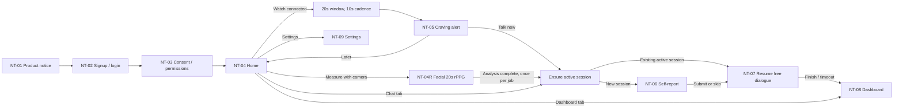
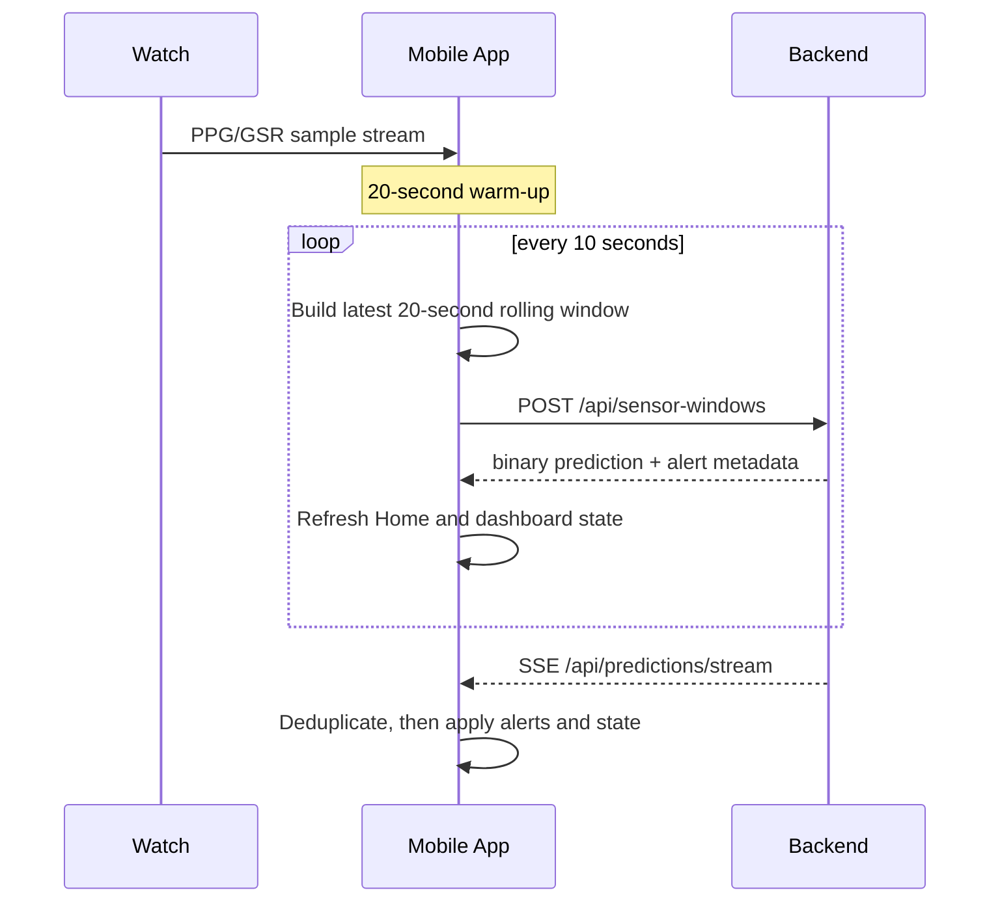

# PRD: NeuroTruth Mobile App (New Build, V22 Baseline)

Last updated: 2026-07-21
Owner: Mobile frontend
Target codebase: `apps/mobile`

Korean mirror: [PRD_neurotruth_mobile.ko.md](PRD_neurotruth_mobile.ko.md)

## 0. Document Standing and Source Authorities

This document specifies the patient-facing mobile app being built new in `apps/mobile`. Where the platform PRD (`docs/prd/PRD_neurotruth.md`) defines system-wide scope, this document fixes **only the surface the patient holds in their hand**, screen by screen.

| Source | Role | Precedence |
|---|---|---|
| Running backend `/openapi.json` | Machine authority for registered routes, methods, request schemas | 1 |
| `apps/test_mobile_app/SERVER_API_SPEC.md` | Documentary authority for response payloads and contract detail | 2 |
| `neurotruth_frontend_handoff_final/neurotruth_frontend_handoff_final.md` | Screen behavior and copy contract | 3 |
| This PRD | Scope, priority, acceptance criteria | 4 |
| `neurotruth_app_design_handoff_final.pptx` | Visual layout reference | 5 |

PPT pages 13–17 are **screenshots of the current Kotlin test app**, not target screens. When behavior or copy conflicts between the PPT and the documents above, the documents win.

`apps/test_mobile_app` is not being retired. It remains the **reference implementation and contract-verification harness**. The new app must satisfy every contract that app already passes: auth retry, sensor idempotency, rPPG job recovery, and the AUQ scale.

---

## 1. Product Definition

### 1.1 One-line definition

The NeuroTruth mobile app lets someone receiving CBT — or willing to seek treatment — **record the moment a craving rises and move straight into a conversation about it**. It is a research-support tool.

### 1.2 Problem

Cravings happen outside the clinic, not on a scheduled hour. The person recalls the episode only after it has passed, and the clinician is left with retrospective self-report. This app captures the circumstances of that moment through wearable biosignals or facial rPPG, and offers a conversation in the same moment.

### 1.3 Goals

- Connect **alert → conversation** within roughly 30 seconds of craving probability rising.
- Give users without a connected Watch an equivalent entry path through **20-second facial measurement**.
- Keep self-report (AUQ) optional while still linking completed responses to dialogue and dashboards.
- Let the user review their own measurements, conversations, and self-reports in the dashboard.
- Recover in-flight dialogue sessions and rPPG jobs **without duplicate creation** after a crash or restart.

### 1.4 Non-goals

- Diagnosis, treatment-effect claims, clinical severity determination, emergency response, automatic dispatch or contact.
- Background or continuous camera measurement; automatic repeated rPPG.
- Direct LLM calls from the app, DGX address exposure, model parameter manipulation.
- Clinician real-time monitoring screens or administrator features (web console only).
- Data export, report body access, bulk download.
- App-invented craving cutoffs (a self-defined low/medium/high grading).

### 1.5 Target users

| Segment | Description | App implication |
|---|---|---|
| Primary | Adult patients in CBT or willing to seek treatment | No stigmatizing or adjudicating language; large type, simple paths |
| Watch owners | Galaxy Watch paired | Passive continuous measurement, alert-driven flow |
| Phone-only users | No wearable | Facial 20-second measurement is the primary measurement path |
| Indirect stakeholders | Researchers, clinicians | No screens in this app; web console only |

---

## 2. Technology Decision

### 2.1 Recommendation: native Android, Kotlin + Jetpack Compose

**Rationale.** Four core capabilities are bound tightly to the Android native surface.

| Capability | Dependency | Cost under cross-platform |
|---|---|---|
| Watch integration | Wear Data Layer, Samsung Health Sensor API (`samsung-health-sensor-api-1.4.1.aar`) | Native module must be written from scratch; no alternative exists |
| 20-second rPPG capture | CameraX 1.4.0 + ML Kit Face Detection 16.1.7, frame timing accuracy | Bridge overhead threatens the capture-length contract (19500–20500 ms) |
| TTS | Android `TextToSpeech` (there is no server TTS route) | Wrappable, but with no upside |
| 16 KB page alignment | ELF and zip alignment verified against AGP 8.5.2 / Gradle 8.7 | Third-party native libraries add alignment verification burden |

There is no iOS release on the roadmap — the platform PRD targets Android — the reference implementation is already Kotlin, and its contract tests exist as JVM unit tests. Choosing React Native would require hand-written native modules for all four of the above, adding bridge risk without any cross-platform benefit.

**The new app therefore starts as a single-module Kotlin + Compose project.** Reversing this decision requires a confirmed iOS release requirement, and even then the Watch and rPPG paths should stay native Android in a hybrid arrangement.

### 2.2 Module and architecture baseline

```text
apps/mobile
  app/          Phone app (Compose UI, ViewModels, API client, local storage)
  wearos/       Wear OS relay (sensor collection and forwarding, alert display only)
```

- UI is Compose; state is exposed from ViewModels as `StateFlow`. Screens consume state and do not carry business branching.
- The network layer is a **single client behind one auth interceptor**. 401 handling (one refresh plus one replay of the original request) is not reimplemented per screen.
- Session entry goes through a **single `ensureSession()` function** (§5.3).
- Verified policy classes from the reference implementation — `AlertActionPolicy`, `ChatRetryPolicy`, `StableClientWindowIdStore`, `RppgFaceStabilityTracker` and peers — are ported together with their tests.

### 2.3 Build baseline

| Item | Value | Reason |
|---|---|---|
| AGP | 8.5.2 | 16 KB page alignment baseline |
| Gradle | 8.7 | Same |
| Kotlin | 1.9.22 | Matches the reference implementation |
| Compose compiler extension | 1.5.8 | Required pairing for Kotlin 1.9.22 |
| Compose BOM | 2024.02.00 | Same |
| compileSdk / targetSdk | 35 | 16 KB pages and Android 15 FGS rules |
| minSdk | 26 (phone), 30 (wearos) | Matches the reference implementation |
| JVM target | 17 | Local toolchain is JDK 21; 1.8 in the reference app is legacy |
| CameraX | 1.4.0 | rPPG capture |
| ML Kit Face Detection | 16.1.7 | Face stability detection |
| Play Services Wearable | 18.1.0 | Data Layer |
| Release gate | APK zip alignment + ELF alignment verification required | 16 KB device support |

Only `~/Library/Android/sdk/platforms/android-32` and `android-33` are installed locally, so `compileSdk 35` requires an SDK download before the first build. `gradle.properties` must not carry an `org.gradle.java.home` path — the reference app hardcodes a Windows JDK path that breaks on macOS and CI.

### 2.4 Foreground service

The 10-second sensor cadence and the SSE connection are P0 requirements that must survive the screen being off, so they run in a foreground service rather than in a ViewModel scope.

| Item | Value |
|---|---|
| FGS type | `health` (matching the Wear side) |
| Permissions | `FOREGROUND_SERVICE`, `FOREGROUND_SERVICE_HEALTH`, `POST_NOTIFICATIONS`, `HIGH_SAMPLING_RATE_SENSORS` as needed |
| Notification channel | Low importance, no sound; copy states that measurement is running, with no craving value in it |
| Start condition | Watch connected **and** `biosignal` consent granted |
| Stop condition | Watch disconnected, consent withdrawn, or logout |
| Boot restart | Not required for P0 — the user reopens the app |

If the user revokes `POST_NOTIFICATIONS`, the service cannot show its notification and therefore cannot run. Detect this and show a Home banner explaining that measurement is paused; do not fail silently.

---

## 3. Information Architecture and Navigation

### 3.1 End-to-end flow



### 3.2 Bottom tabs

| Tab | Purpose | State preserved across tab switches |
|---|---|---|
| Home | Profile summary, current craving state, Watch connection, facial measurement entry | Last craving state, Watch state |
| Dashboard | Last hour, today, 7-day, 30-day records | Selected date and range |
| Chat | Resume the active conversation or start a new free dialogue | Active `sessionId`, unsent draft text |

**There are exactly three tabs.** Profile is not a tab; it is reached through Settings at the top right of Home. Bottom tabs are hidden before authentication completes (NT-01 through NT-03).

### 3.3 Screen inventory

| ID | Screen | Entry | Priority |
|---|---|---|---|
| NT-01 | Product notice | First launch, notice version change, Settings | P0 |
| NT-02 | Signup / login | After NT-01, after logout | P0 |
| NT-03 | Consent / permissions | Signup flow, Settings | P0 |
| NT-04 | Home | Default after authentication | P0 |
| NT-04R | Facial rPPG measurement | Home `카메라로 측정` | P1 |
| NT-05 | Craving alert | System notification / popup | P0 |
| NT-06 | Self-report (AUQ) | On new session creation | P1 |
| NT-07 | AI chat | Alert, Chat tab, rPPG completion | P0 |
| NT-08 | Dashboard | Bottom tab, after conversation ends | P1 |
| NT-09 | Settings | Home top right | P1 |

---

## 4. Screen Requirements

### NT-01 · Product notice

**Purpose.** Make the user understand what this app is and is not, before they create an account.

**Content.**
- One-line definition: a research-support system that records craving situations and supports conversation.
- Audience: people in treatment or willing to seek it, who need ongoing records and dialogue support during cravings.
- Limitation notice, in a visually distinct emphasis block: does not replace medical care, diagnosis, prescription, or emergency response.
- Bottom pinned button `[확인하고 계속]` → NT-02.

**Behavior.**
- Shown on first launch and whenever the notice version changes.
- The acknowledged notice version is stored on device and can be reopened from Settings at any time.
- Cannot be skipped with the back gesture.

**Acceptance.** A freshly installed user cannot reach NT-02 without seeing NT-01. Bumping the notice version shows it again on the next launch.

---

### NT-02 · Signup and login

**Purpose.** The user creates their own account and signs in. Self-directed signup — no administrator invitation or issued code.

**Content.** Display name (optional), email, password, password confirmation, `[가입하고 시작]`, `[기존 계정으로 로그인]`.

The display name is what NT-04 Home shows in its profile summary. Without a capture path here it would be null for every user, so collect it at signup (sent as `name` on the signup body) and allow editing later through `PATCH /api/me` from NT-09. When it is absent, Home falls back to the email local part.

**Behavior.**
- A new user enters account details here and **only navigates to NT-03**. There is no server call at this point.
- The entered password is held **in memory only** for the duration of the flow. It is never written to disk, logs, or crash reports.
- Actual signup completes at NT-03 as a single `POST /api/auth/patient/signup` carrying account details plus the consent snapshot. The current server requires consent on the signup request.
- Passwords are at least 12 characters (server contract). Validate client-side first to avoid a round trip.
- Existing-account login calls `POST /api/auth/login`, then `GET /api/me` to check current consent: if required consents are satisfied, go to Home; otherwise go to NT-03.

**Token policy.**
- Access tokens last 15 minutes by default; opaque refresh tokens last 30 days and rotate on every refresh.
- On 401, perform **one refresh, then one replay of the original request** — no further attempts.
- If refresh fails, tear down in-flight recording, TTS, polling, and sensor upload, then navigate to login.
- Refresh tokens are stored only in Android Keystore-backed storage.

**Acceptance.** Opening any screen with an expired access token loads normally with no user action. When refresh also fails, the app returns to login with no sensor upload left running in the background.

---

### NT-03 · Consent and permissions

**Purpose.** Capture required consents and let the user disable optional features individually.

**Required consents (all three mandatory).** Terms of service `tos`, privacy `privacy`, sensitive data `sensitive`.

**Optional consents and feature gates.**

| Optional consent | Key | When on | When off |
|---|---|---|---|
| Biosignal | `biosignal` | Watch PPG/GSR collection and upload | Watch measurement disabled |
| AI analysis | `aiAnalysis` | Craving model inference, session dialogue | Sensor retention only; craving results hidden |
| Notification | `notification` | Craving alerts and conversation prompts | Results still recorded; no alerts shown |
| Voice | `voice` | STT input | Text input only |
| Facial rPPG | `cameraRppg` | Facial measurement available | `카메라로 측정` disabled with a stated reason |
| Face video retention | `faceVideoRetention` | rPPG video upload and server retention | Facial measurement cannot start |
| Report generation | `reportGeneration` | Session report generation | No report generated |

- Camera rPPG requires **all four** of `biosignal`, `aiAnalysis`, `cameraRppg`, `faceVideoRetention`.
- `notification=false` suppresses alert presentation only. It does not stop the user from opening chat or AUQ manually.
- Consent changes append an **immutable snapshot** (`POST /api/me/consents`) rather than overwriting. Withdrawal blocks new processing but does not delete previously retained data, and the screen states this explicitly.

#### Consent version strings (required by the server)

`POST /api/auth/patient/signup` and `POST /api/me/consents` both **require** three non-empty version strings in the consent object, alongside the ten booleans:

| Field | Value | Source |
|---|---|---|
| `tosVersion` | `"1.0"` | App constant, shipped with the release |
| `privacyVersion` | `"1.0"` | App constant, shipped with the release |
| `consentFormVersion` | `"1.0"` | App constant, shipped with the release |

Omitting any of them fails schema validation, so signup itself fails. **No endpoint publishes the currently required versions** — `GET /api/me` returns only the stored snapshot — so these are compile-time constants in the app, declared in one place next to the NT-01 notice version.

These are distinct from the NT-01 acknowledged notice version, which is a device-local value that never leaves the phone.

**Re-consent on version bump.** After login, compare the stored snapshot's three version strings against the app constants. If any differs, route to NT-03 for re-consent (`POST /api/me/consents`) instead of going straight to Home. Treating "required consents satisfied" as merely `tos && privacy && sensitive == true` would silently keep stale consent across a policy change.

**Device permissions.** Consent and OS permission are separate. This screen stores consent only; **microphone and camera permissions are requested when the corresponding feature is first opened**. Notification permission (`POST_NOTIFICATIONS`) is requested when notification consent is turned on.

**Behavior.** `[저장하고 홈으로]` → (new user) signup call carrying the consent snapshot → Home. (existing account) `POST /api/me/consents` → Home.

**Acceptance.** Signing up with every optional consent off still yields a working app, and each disabled feature explains why it is disabled and where to enable it.

---

### NT-04 · Home

**Purpose.** Show current state at a glance and route to the next action — measure, talk, or review.

**Content is limited to three regions.**

1. **Profile summary** — display name, account summary, `설정` at top right
2. **Craving state card** — four-stage copy, framing note, measurement time and device at the lower right
3. **Watch state and camera measurement** — connection state and `[카메라로 측정]`

**Not on Home.** PPG waveform, raw signal, server status, permission-check buttons, developer buttons, precise probability percentage. Raw signal and detailed charts live only in the dashboard.

**Developer entry.** The on-device test screen is reachable only through a hidden **2.5-second long press on the profile header**, with no affordance visible on the normal user screen.

#### Four-stage craving display

| `cravingProbability` | `stageCounts` key (dashboard only) | Stage | Patient-facing copy |
|---:|---|---|---|
| `0.00 ≤ p < 0.25` | `low` | 안전 | 아무 문제 없어요! |
| `0.25 ≤ p < 0.50` | `observe` | 관찰 | 관찰이 필요해요, 심각하진 않아요! |
| `0.50 ≤ p < 0.75` | `caution` | 주의 | 주의가 필요해요, 술이 드시고 싶으신가요? |
| `0.75 ≤ p ≤ 1.00` | `high` | 심각 | 갈망이 심해보여요. 챗봇과 대화를 시작할까요? |

**The stage is computed client-side from `cravingProbability` alone.** Never derive it from `class`, `classCode`, or `classProbabilities` — those come from a **binary** classifier where `classCode` is already `"high"` at p ≥ 0.5. Binding the stage to `classCode` shows 심각 for every p ≥ 0.5, which is wrong for the entire 주의 band. The `low|observe|caution|high` keys in the table above exist only as `stageCounts` keys in `GET /api/me/craving-dashboard`; they are not present in a prediction payload. A unit test must pin `p = 0.60 → 주의`.

- These four bands are a **research display convention, not a clinical risk level or diagnostic cutoff.** The card carries copy to that effect.
- Do not surface the precise percentage prominently.
- When `alertLevel` is `recommend` or `required`, show a **separate** `대화 권장` marker alongside the probability copy.
- With no measurement, show **측정 데이터 없음** — never 0% or "low".

#### Latest-state resolution

- Latest state is decided by `timestampMs`.
- A late-arriving older camera result must not overwrite a newer Watch result.
- On an exact `timestampMs` tie, Watch (`source=watch_sensor`) wins.
- Camera results (`source=camera_rppg`) are **always retained in dashboard history**, independently of the Home latest state.
- Formatting: a live Watch value reads `실시간 · Watch`; a stored value reads `YYYY-MM-DD HH:mm · Watch|카메라`.

#### Measurement behavior by Watch state

| Watch state | Home behavior |
|---|---|
| Connected | Watch monitoring is the default measurement. `[카메라로 측정]` is **disabled**, explaining that the Watch must be disconnected first |
| Confirmed disconnected | With all four rPPG consents, camera permission, and server readiness satisfied, `[카메라로 측정]` becomes the **primary action** |
| Checking / error | **Do not infer disconnection.** Camera button stays disabled with a status-checking message |

Connection is determined client-side from the Wear Data Layer connected-node list. An empty list counts as disconnected **only when confirmed**. This determination adds no API field or endpoint.

**Acceptance.** While a Watch is connected, the camera button cannot be pressed and the reason is visible. In the checking state, the camera button does not become enabled. After a camera measurement, an arriving Watch prediction replaces only the Home latest state while the camera entry remains in dashboard history.

---

### NT-04R · Facial 20-second rPPG measurement

**Purpose.** Give users without a Watch an equivalent measurement path, and connect it to conversation immediately afterward.

**Entry conditions (all required).**
- Four consents: `biosignal`, `aiAnalysis`, `cameraRppg`, `faceVideoRetention`
- Camera permission granted
- `GET /api/rppg/status` reports `enabled`, `available`, and `modelLoaded` — only all three together are interpreted as `ready`
- Watch is confirmed disconnected

**Capture state machine.**

```text
준비 → 얼굴 찾기 → 안정화 → 20초 촬영 → 업로드 → 분석 대기 → 완료 | 재촬영 | 실패
Ready → Finding face → Stabilizing → 20s capture → Upload → Awaiting analysis → Complete | Recapture | Failed
```

- Uses the front camera.
- Capture starts automatically once a single face is held inside the guide region for **1 second**.
- Capture is cancelled if the face leaves the guide region for **1 second or more**, or if the app moves to the background.
- The screen shows remaining time and a progress bar, with a footer notice: facial video is retained encrypted on the server until an administrator deletes it.

**Upload contract.**
- MP4, `durationMs` within `19500..20500`, default maximum 40 MiB.
- `POST /api/rppg/jobs` multipart: `video`, `clientCaptureId`, `capturedAtMs`, `durationMs`, optional `sessionId`.
- **Delete the local MP4 immediately after HTTP 202**, keeping only `jobId`, `captureId`, and `clientCaptureId` for recovery.
- An idempotent retry with the same `clientCaptureId` and identical video returns 202 for the existing job with its current status.

**Job status handling.**

| Status | App behavior |
|---|---|
| `queued` / `running` | Poll every 2 s; show the analysis-waiting screen (see the ceiling below) |
| `completed` | Persist result → `ensureSession()` → navigate to chat (**once per job**) |
| `retry_required` (quality) | **A new capture**, not a retry of the same job |
| `failed` with `retryAllowed=true` | `POST /api/rppg/jobs/{id}/retry` to re-analyze |
| `failed` with `retryAllowed=false` | Explain and return to Home |

**Polling schedule.** Poll `GET /api/rppg/jobs/{jobId}` every 2 seconds. After **3 minutes** without a terminal status, stop the foreground spinner and show a "분석이 예상보다 오래 걸리고 있어요 — 완료되면 알려드릴게요" state with a `[홈으로]` action, then drop to a 30-second background check. This bounds both the spinner and the battery cost of a job that never leaves `running`. A transport error is not a terminal status: retry on the same 2-second tick and let the 3-minute ceiling cover it.

- Polling resumes after an app restart whenever the job is not in a terminal state.
- Even if the completion event arrives repeatedly, session creation and navigation happen **exactly once** (route-once claim).
- The app never calls DGX directly and never exposes its address; it calls only the NeuroTruth backend.

**Acceptance.** Force-quitting after capture and reopening does not create a new job; the existing job's result is picked up. Duplicate completion events do not open the chat screen twice. No MP4 remains in device storage after the 202.

---

### NT-05 · Craving alert

**Purpose.** Deliver a **conversation offer**, not a determination.

**Behavior.**
- Presented as a **phone system notification or popup**, not an in-app card.
- Copy avoids diagnostic or conclusive framing. Example: "갈망 가능성이 높아진 것으로 보여요 / 지금 상황을 편하게 이야기해 볼까요?"
- Two actions: `[지금 대화하기]` → `ensureSession()`, and `[나중에]` → return to the current screen without creating a session.
- The same `alertId` never produces a duplicate alert.
- The Watch follows the server's `alertAction`/`alertLevel` and never raises its own alert merely because class is 1.
- With `notification` consent off, no alert is shown while results are still recorded normally.

**Acceptance.** When the same alert arrives via both SSE and the upload response, exactly one notification appears. Choosing `나중에` creates no session on the server.

---

### NT-06 · Self-report (AUQ)

**Purpose.** Capture in-the-moment self-report **without blocking the conversation**.

**Presentation.**
- Eight items, one item per screen, with `1 / 8` progress at the top.
- Each item offers seven sentence-form choices; numbers are never shown on screen.
- `[건너뛰고 대화하기]` is offered **at all times**, and skipping never blocks chat.

| API value | On-screen label |
|---:|---|
| 0 | 매우 그렇지 않다 |
| 1 | 그렇지 않다 |
| 2 | 조금 그렇지 않다 |
| 3 | 보통이다 |
| 4 | 조금 그렇다 |
| 5 | 그렇다 |
| 6 | 매우 그렇다 |

**Submission contract** (`POST /api/sessions/{sessionId}/assessments`). The request body rejects unknown fields, and `phase` and `attemptNo` are **required with no defaults** — omitting them produces a schema `422`, not the documented `invalid_auq_scale` error, leaving the user with an uncorrectable failure. The full body is:

```json
{
  "instrumentCode": "AUQ",
  "version": "2.0",
  "phase": "pre_intervention",
  "attemptNo": 1,
  "answers": {
    "responses": [3, 4, 2, 3, 5, 1, 3, 4],
    "scoredItems": [3, 4, 2, 3, 5, 1, 3, 4],
    "capturedAtMs": 1784160000000,
    "rawTotalScore": 25
  },
  "rawScore": 25,
  "scaleMin": 0,
  "scaleMax": 48
}
```

- `phase` is `"pre_intervention"` for the AUQ shown before dialogue. (`post_intervention` and `followup` are accepted by the server but unused by this app.)
- `attemptNo` starts at 1 and is `≥ 1`.
- `responses` and `scoredItems` each contain exactly eight integers in `0..6`, and the two arrays match. All eight items score in the same direction in the current Korean research adaptation, so they are identical.
- `rawScore` = `answers.rawTotalScore` = their sum, within `0..48`.
- `scaleMin=0`, `scaleMax=48`.
- On a scale mismatch the server returns `422` with `code="invalid_auq_scale"` and writes nothing.

**There is no idempotency key on this endpoint** — unlike messages, sensor windows, and rPPG jobs. A timeout followed by a blind retry writes two AUQ rows for one episode and corrupts the §NT-08 average. Therefore: on an ambiguous outcome, **do not auto-retry**. Treat the submission as failed, keep `[건너뛰고 대화하기]` available, and if the user chooses to submit again, send `attemptNo = 2`. A session may legitimately hold more than one attempt; §NT-08 aggregates whatever the server returns and does not deduplicate client-side.

**Display rules.**
- The user-facing total is **0–48**.
- Do not invent low/medium/high cutoffs.
- Keep explanation at the level of "a higher total means more alcohol-urge-related responses at that time".
- Do not silently apply scoring rules from another AUQ wording or version. The current Korean research adaptation scores all eight items in the same direction.

**Acceptance.** Selecting 0 on all eight items saves as a valid total of 0 — never treated as an empty response. Skipping sends no placeholder request and goes straight to dialogue.

---

### NT-07 · AI chat (free dialogue, STT, TTS)

**Purpose.** Provide free-form dialogue in which the user states what help they want, rather than a fixed questionnaire.

**Dialogue principles.**
- Opens with a neutral invitation: "지금 상황이나 원하는 도움을 편하게 말씀해 주세요."
- **At most one question per AI response**; a response with empathy and reflection and no question is equally valid.
- No fixed questionnaire, slot progress indicator, or mandatory question order on screen.
- Do not re-ask what the user has already answered or declined (the server-side ledger owns this).
- Supports manual finish and a **one-hour inactivity timeout** (3,600 seconds by default).

**Message send and retry.**
1. Generate a `clientMessageId` (UUID) immediately before sending.
2. Block duplicate sends of the same message while one is in flight.
3. On AI provider failure (502), **keep the user's bubble in place** and show `[응답 다시 받기]`.
4. Retry **once only**, with the same ID, identical body, and identical `inputModality`.
5. If the user edits the body, treat it as a new message with a new ID.
6. A different payload under the same ID returns 409; never auto-generate a new ID in response.

**STT.**
- The microphone button starts and stops recording, **30 seconds maximum**.
- `POST /api/sessions/{sessionId}/transcriptions`, multipart (`audio`: `.m4a` or `.wav`, `language=ko`). Requires `voice` consent and an active owned session.
- Place the returned transcript **in the editable input field for the user to review**. Never auto-send.
- After confirmation, it enters the normal message path with `inputModality="voice"` — the same route and the same retry contract as typed text.
- **Text input must keep working** when voice consent or permission is absent, or when STT fails.
- Delete the temporary audio file immediately on upload completion, cancellation, or leaving the screen.

**TTS.**
- There is no server TTS. Use the device's Android `TextToSpeech`.
- Every AI bubble offers `[듣기]` / `[정지]`.
- Only one response plays at a time; playing another response, leaving the screen, or logging out stops the current playback.
- The global auto-read switch defaults to **OFF**.
- If TTS is unavailable or fails, the text answer remains intact.

**Acceptance.** A 502 leaves the user's bubble neither removed nor duplicated, and after retry exactly one copy of the message exists in the conversation. Denying microphone permission leaves text conversation fully functional. Leaving the screen stops TTS playback.

---

### NT-08 · Dashboard

**Purpose.** Let the user review their own record. One scroll, four sections in order.

| Section | Default range | Representation | Empty-data handling |
|---|---|---|---|
| Recent craving change | Last 1 hour | Four-stage step timeline over real 10-second samples | Leave a gap; do not connect missing samples |
| Period stage history | Selected day / week / month | Count-scaled four-stage stacked bars | Blank white span |
| Craving events | Selected day / week / month | Hourly or daily event count | Distinguish no-data from a valid zero |
| Self-report | Selected day / week / month | Hourly or daily 0–48 average | No responses = no data |
| Signals | Live | Separate preprocessed Watch PPG and EDA traces | Not-connected / no-data copy |

**The patient dashboard does not render state-inference cards or report-status cards.** The backend's create/store/read contracts remain intact for compatibility.

#### Recent-hour stage timeline

- Map class-1 softmax to four horizontal stage lanes: 안정, 관찰, 주의, 위험.
- Render thick rounded categorical runs and keep missing intervals disconnected.
- Show only timestamp and stage in selection detail; do not expose the exact probability.
- Use `GET /api/me/craving-probability-series?range=1h`: last 60 minutes, 10-second buckets, up to 360 points. **Never substitute truncated 24-hour data.**

#### Selected day/week/month stage counts

- Use `GET /api/me/craving-calendar?timezone=<IANA>&view=day|week|month&anchor=YYYY-MM-DD`.
- Stack the raw `stageCounts` (`low|observe|caution|high`) without percentage normalization.
- A day view contains 24 hourly buckets on a fixed `0..360` measurements/hour axis.
- Week and month views contain daily buckets on a fixed
  `0..8,640` measurements/day axis (`360 × 24`).
- Tapping a bar shows the period, total measurements, and raw count per stage.
- A bucket with no samples is a blank white span, not a grey placeholder or a zero-percent bar.

#### Craving events

- Tapping a bar shows the date and the number of occurrences.
- Where no prediction exists at all, render an empty span; where predictions exist but no alert fired, render a **valid zero** (a dot).

#### Self-report

- The UI scale is 0–48.
- Tapping a bar shows `평균 X/48`, the response count, and the period.
- Prefer the aggregate API's `averageScore` (0–48). Fall back to `averageNormalizedScore × 48` only for responses missing the raw-scale field during a coordinated rollout.

**Acceptance.** On a brand-new account every section reads "no data" rather than zero. A day with zero events is visually distinguishable from a day with no predictions at all.

---

### NT-09 · Settings

**Content.** Account information; required and optional consent status and changes; re-read the product notice; device permission status for notification, microphone, camera; change password; log out.

**Logout teardown.** SSE connection, Watch sensor upload, rPPG polling, recording, TTS playback, and per-user screen cache. Send the refresh token to `POST /api/auth/logout` and clear local tokens.

**Acceptance.** No network traffic remains immediately after logout, and signing in as a different user shows none of the previous user's dashboard cache.

---

## 5. Domain Rules

### 5.1 Watch sensor collection contract



- `windowMs = 20000` (accepted range `19500..20500`), must equal `windowEndMs - windowStartMs`; mismatches return 422.
- A **20-second warm-up** before the first send, then the latest 20-second window **every 10 seconds**.
- 500 PPG samples per channel (25 Hz) and 20 EDA samples (1 Hz).
- Retrying a window uses the **same `clientWindowId` and a byte-identical payload**. Reuse with different content returns 409.
- Watch disconnected, preparing, collecting, and upload-failed are four distinct displayed states.
- The Watch holds no backend credentials and never calls the backend. The phone owns authentication and transmission.

### 5.2 Prediction SSE

- `GET /api/predictions/stream` with `Accept: text/event-stream`, connecting and reconnecting with a current access token.
- The upload response and SSE can deliver the same prediction or alert, so **deduplicate by ID**.
- Only display-safe metadata is relayed to the Watch.

### 5.3 Unified session entry — `ensureSession()`

The alert's `[지금 대화하기]`, the Home `챗봇` tab, and rPPG completion all call **the same function**.

```text
ensureSession(entryPoint):
  POST /api/sessions {sessionType, triggerAlertId}
  ├─ server returned the existing active session → resume NT-07 dialogue, no AUQ
  └─ server created a new session               → NT-06 AUQ (complete or skip) → NT-07
```

#### How to tell "new" from "existing"

The response body carries no `created` or `isNew` flag; `sessionId`, `status`, `interactionPhase`, and the timestamps look identical in both cases. The discriminator is:

> **`assistantText` is non-null ⇒ a new session was created.** The server attaches its neutral opening invitation only when it creates the session; resuming an existing active session returns `assistantText: null`.

Do not infer newness by comparing `sessionId` against a locally cached value. That is wrong after a reinstall, after the local store is cleared, and after the server finalizes a session on inactivity timeout — in each case the app would show the AUQ again for a conversation the user is already in. A local cache may be used as a fast path to skip the round trip, but the response's `assistantText` is the authority. Pin this in a unit test.

#### `sessionType` per entry point

`sessionType` is a closed enum (`alert_checkin`, `manual_checkin`, `scheduled_checkin`) and any other string is a `422`. Because all entry points share one function, the caller must pass its own type — hardcoding `manual_checkin` everywhere would mislabel every alert-driven session in the research dataset.

| Entry point | `sessionType` | `triggerAlertId` |
|---|---|---|
| NT-05 `[지금 대화하기]` | `alert_checkin` | The alert's `alertId` |
| NT-04 Chat tab | `manual_checkin` | `null` |
| NT-04R rPPG completion | `manual_checkin` | `null` |

`scheduled_checkin` is unused by this app. rPPG completion is user-initiated rather than alert-driven, so it is a manual check-in even though the app navigates automatically.

- A patient has **at most one** active session.
- A session ends on explicit finish or on inactivity timeout (3,600 seconds by default).
- rPPG completion traverses this path exactly once per job.
- Do not reimplement this rule per screen. Duplicated implementations are the direct cause of repeated AUQ prompts and duplicate session creation.

### 5.4 Copy principles

- Nothing in alerts, state, or dashboards may imply diagnosis, a conclusive determination, treatment effect, or emergency response.
- The screen states that 안전 / 관찰 / 주의 / 심각 are research display bands.
- In imminent-risk dialogue, 119 and the suicide prevention line 109 are surfaced. **The ask-once and the audit write happen server-side inside the dialogue turn** — there is no client endpoint for them, and none exists in the 42-route inventory. The app's only obligations are to render `safety.supportResources` (each entry is `{label, contact}`) verbatim, to make the contacts tappable, and never to suppress, reorder, or reword them. The app must also show that this record is not real-time monitoring and guarantees neither contact nor response.

### 5.5 Phone ↔ Watch Data Layer contract

The Watch holds no backend credentials. It streams samples to the phone, and the phone owns windowing, authentication, and upload.

**Watch → phone.** Nine channel paths under `/sensor/`: `hr`, `ppg`, `ppg_ir`, `ppg_red`, `eda`, `accel_x`, `accel_y`, `accel_z`, `skin_temp`. Payloads are **batched binary**, never one message per sample — at 25 Hz, per-sample messages saturate the `MessageClient` queue and let one sensor starve the others.

```text
[count : Int32] then count × ( [timestampMs : Int64] [value : Float32] )
total bytes = 4 + count * 12
```

Reject `count <= 0`, `count > 10000`, or any buffer whose remaining length is not exactly `count * 12`. The watch flushes its trackers on roughly a 200 ms cadence and sends one batch per channel per flush.

**Phone → watch.** One path, `/prediction/class`, carrying a JSON object with `class`, `timestampMs`, and `hasAlertMetadata` always present, plus `sessionId`, `confidence`, `sequence`, and alert fields when available. `cravingProbability` and `classProbabilities` are deliberately **not** relayed — the watch shows a coarse state, not a probability. Camera rPPG results are never relayed to the watch.

**Sampling-rate ownership.** The watch emits at its native tracker rates; **the phone owns the fixed grid.** The phone resamples to exactly 500 PPG samples per channel at 40 ms spacing and 20 EDA samples at 1000 ms spacing before upload, using linear interpolation between bracketing samples, nearest-neighbour hold across gaps longer than three intervals, and edge hold at the boundaries. This is what the `sync` block in the upload body declares.

**Connection state.** `getConnectedNodes()` returning an empty list is the *only* signal for disconnected, and it must be observed **twice consecutively at least 3 seconds apart** before Home treats it as confirmed. A query failure is `error`, not disconnected. Peer connect/disconnect events trigger a fresh authoritative query rather than directly setting state.

**Buffering.** The watch buffers only within a flush cycle. If the phone app is not running, samples are dropped rather than queued — this is a research prototype and gapped data is preferable to stale data presented as current.

### 5.6 Offline behavior

Sensor windows that fail to upload for network reasons are retried with the **same `clientWindowId` and a byte-identical payload**. Retry storage is bounded:

| Rule | Value |
|---|---|
| Maximum queued windows | 60 (≈10 minutes at the 10-second cadence) |
| Eviction | Oldest first |
| User-visible effect | A Home note: `일부 구간이 저장되지 않았습니다` |

Each window carries 500 × 3 PPG samples plus 20 EDA samples, so an unbounded queue exhausts memory and disk in exactly the poor-connectivity conditions this behavior exists for. The cap is provisional for P0 and may be revised in P1 once real field data exists.

The `clientWindowId` for a given `(session, sequence)` must survive process death — derive it from a persisted store keyed on that pair, not from a fresh UUID at send time.

---

## 6. Per-Screen State Definitions

| Screen | Default | Loading / in progress | Empty | Error | Recovery |
|---|---|---|---|---|---|
| Home | Profile, craving, Watch | Fetching user/state | No measurement data | Server connection failed | Refresh, login recovery |
| Watch | Connected / collecting | 20s warm-up, uploading | Not connected | Permission / network error | Reconnect, resend same window |
| Alert | Talk now / Later | Checking session | N/A | Session creation failed | Retry or Home |
| Self-report | Item with seven choices | Submitting | N/A | Submission outcome unclear | Check state, then apply resubmit policy |
| Chat | Input ready | Sending, STT, TTS | Conversation start prompt | AI response failed | One retry with the same message |
| rPPG | Capture ready | Stabilizing, capturing, uploading, analyzing | N/A | Quality / network / permission error | New capture or permitted job retry |
| Dashboard | Charts and detail | Aggregating range | Grey empty span | Query failed | Refresh with identical parameters |
| Settings | Current state | Saving | N/A | Save failed | Preserve edits, then retry |

### Shared error UX

| Status | User-facing behavior |
|---:|---|
| 401 | One token refresh; on failure, log out |
| 403 | Explain the missing consent or permission; route to Settings |
| 404 | State that the owned session or job is gone; return to list or Home |
| 409 | Reconcile duplicate ID or session state. **Never auto-generate a new ID** |
| 413 / 415 / 422 | Let the user correct file size, format, or input |
| 502 | Offer one manual retry of the same chat message |
| 503 | Mark only that feature temporarily unavailable; keep the rest working |
| 504 | Explain the STT or external-analysis timeout and offer retry |

**Never display internal server addresses, model paths, credentials, or stack traces in error UI.**

---

## 7. Local Storage and Security

| Data | Purpose | Store | Cleared when |
|---|---|---|---|
| Access / refresh token | Maintain authentication | Android Keystore-backed | Logout, refresh failure |
| Acknowledged notice version | Avoid repeating first-run notice | Regular preferences | Version change |
| Active `sessionId` | Resume dialogue after restart | Regular preferences | Finish, timeout, logout |
| Pending `clientMessageId` and request | Prevent duplicate chat retry | **Keystore-encrypted** | Success, **retries exhausted**, logout |
| rPPG `jobId`, `captureId`, `clientCaptureId` | Polling recovery | Regular preferences | Terminal state handled, logout |
| rPPG completion-routed flag | Prevent duplicate chat navigation | Regular preferences | After completion handling |
| STT audio file | Transient upload | App cache | Immediately on success, failure, cancel, or leaving the screen |
| rPPG MP4 | Manual re-upload before 202 | App cache | Immediately after HTTP 202 |
| Dashboard cache | Screen restoration | **Keystore-encrypted** | User switch, logout |

**Never persisted in ordinary app storage:** passwords, API keys, DGX internal addresses, source audio, or facial video after the 202.

The pending chat request holds the patient's verbatim words about a craving episode, and the dashboard cache holds craving probabilities and AUQ scores. Both are sensitive health data that the backend stores under AES-256-GCM, so the client must not store them weaker. Use the same Keystore-backed AES/GCM wrapper as the refresh token (`AndroidKeyStore` alias, randomized IV, 128-bit tag) rather than plain `SharedPreferences`.

The manifest must set `android:allowBackup="false"` and supply `dataExtractionRules` that exclude the app's preference and cache directories, so none of this leaves the device through cloud backup or device-to-device transfer.

Logs and crash reports must not contain conversation bodies, transcripts, email addresses, or tokens.

---

## 8. Non-Functional Requirements

| Item | Requirement | Measurement |
|---|---|---|
| App start | First Home render within 2 seconds of cold start (with cached state) | Mid-tier physical device |
| Sensor upload | Maintain the 10-second cadence regardless of screen state | Including background |
| Battery | Measure and report hourly drain under continuous Watch collection | 8-hour physical-device session |
| rPPG capture accuracy | 100% compliance with `durationMs` 19500–20500 | Automated test |
| 16 KB pages | APK zip and ELF alignment verification pass | Release gate |
| Offline | No crash with no network; show "no connection" and resend with the same `clientWindowId` on recovery | Manual scenario |
| Accessibility | Layout survives body text scaled to at least 130%; every action has a contentDescription | Automated plus manual |
| Dark mode | Supported; the camera screen is always dark-themed | Manual |
| Language | Korean only | — |

---

## 9. Release Scope

### P0 — demo critical

- NT-01 product notice, NT-02 signup/login, NT-03 required consent
- NT-04 Home profile, four-stage craving state, Watch state
- Three bottom tabs (홈 · 대시보드 · 챗봇)
- Watch 20-second warm-up, 10-second cadence, sensor upload
- Craving alert `지금 대화하기` / `나중에`
- NT-07 free dialogue, one retry of the same message, manual finish
- Text input, STT transcript editing, device TTS
- Latest state, plus the recent-hour chart only (§NT-08 section 1). The other four dashboard sections are P1.

**Until NT-06 ships**, `ensureSession()`'s new-session branch navigates directly to NT-07 with no AUQ and no placeholder request. The new-vs-existing discriminator (§5.3) is still exercised from P0 so the branch is correct when NT-06 lands.

### P1 — integration complete

- NT-06 eight-item, seven-point sentence-form self-report with skip
- NT-04R facial 20-second rPPG capture, job recovery, post-completion chat navigation
- Today's 24-hour stacked bars, craving events, self-report chart, PPG preview
- NT-09 Settings: optional consents, permissions, logout
- Session and rPPG polling recovery after process death

### P2 — later

- Widget and quick action that jump straight into conversation
- Alert history screen
- Custom range selection in the dashboard

---

## 10. Acceptance Scenarios

1. A new user moves through notice → signup → consent → Home.
2. After the Watch connects, 20 seconds are collected and predictions refresh every 10 seconds thereafter.
3. From an alert, completing or skipping the self-report leads into **the same** free dialogue.
4. Both typed and STT input send successfully, and the AI response is available as text and TTS.
5. On AI failure the user's message is retried exactly once and never duplicated.
6. Stabilizing the face for 1 second and capturing for 20 seconds navigates to chat when analysis completes.
7. Restarting the app recovers the active conversation and rPPG job without duplicate creation.
8. The dashboard distinguishes "no data" from a valid zero.
9. Logout tears down SSE, sensors, recording, TTS, polling, and user cache.
10. The camera button is disabled while a Watch is connected and enabled only on confirmed disconnection.
11. An account with every optional consent off runs without crashing and explains each disabled feature.
12. An AUQ answered with 0 on all eight items is stored as a total of 0.

---

## 11. Requirement-to-API Traceability

| Screen / action | API or event | Notes |
|---|---|---|
| NT-02 / NT-03 signup | `POST /api/auth/patient/signup` | Consent snapshot required |
| Login, refresh, logout | `POST /api/auth/login` · `/refresh` · `/logout` | Refresh rotates every time |
| Change password | `POST /api/auth/change-password` | 12+ characters |
| Profile | `GET` / `PATCH /api/me` | name, birthYear, gender |
| Consent | `POST /api/me/consents` | Appends an immutable snapshot |
| NT-04 sensor window | `POST /api/sensor-windows` | 20-second window, `clientWindowId` idempotency |
| NT-04 / NT-08 live prediction | `GET /api/predictions/stream` (SSE) | `source=watch_sensor` / `camera_rppg` |
| Session start / restore | `POST /api/sessions` · `GET /api/sessions/{id}` | New → AUQ then dialogue; active → resume directly |
| NT-07 messages | `POST /api/sessions/{id}/messages` | `clientMessageId`, `inputModality` |
| NT-06 self-report | `POST /api/sessions/{id}/assessments` | `version=2.0`, 8 × `0..6`, total `0..48` |
| Session finish | `POST /api/sessions/{id}/finish` | |
| STT | `GET /api/stt/status` · `POST /api/sessions/{id}/transcriptions` | Text input persists when the server is unavailable |
| TTS | Device-local speech synthesis | **No server route** |
| NT-08 combined dashboard | `GET /api/me/craving-dashboard` | IANA timezone required, `stageCounts` |
| NT-08 probability series | `GET /api/me/craving-probability-series?range=1h` | 10-second buckets, ≤360 points, no interpolation |
| NT-08 history | `GET /api/me/dashboard?range=24h|7d|30d` | |
| NT-08 PPG preview | `GET /api/me/predictions/{id}/ppg-preview` | ≤512 points, `no-store` |
| NT-04R rPPG | `GET /api/rppg/status` · `POST /api/rppg/jobs` · `GET /api/rppg/jobs/{id}` · `POST /api/rppg/jobs/{id}/retry` | One routing per completed job |

**The app never calls:** any `/api/admin/*` route (web console only) or DGX directly. The retired `/sensor-window`, `/prediction-stream`, `/api/llm/chat`, and `/api/intervention/*` paths are not contracts.

---

## 12. Open Issues and Risks

| ID | Item | Detail | Proposal | Status |
|---|---|---|---|---|
| O-001 | Four-stage copy | PPT page 6's dashboard legend reads `위험`, while the handoff Markdown and API spec read `심각` | **Standardize on `심각`** and log the PPT legend for correction. This PRD uses `심각` | Needs confirmation |
| O-002 | Stack confirmation | Kotlin native recommended (§2.1). V22 spec D-002 decided "modify the existing Kotlin app", but the new app is being built fresh in `apps/mobile` | Build the new app in Kotlin; keep `apps/test_mobile_app` for contract verification | Needs confirmation |
| O-003 | Wear OS UI scope | Whether to rebuild the Wear UI or port the existing relay | Port the existing Wear relay as-is; UI redesign is out of scope | Needs confirmation |
| O-004 | Report exposure | `REPORT_AI_ENABLED=false` by default, so report status is always `not_started` | Do not render a report card on patient screens (§NT-08). Enabling the flag requires no app change | Decided |
| O-005 | Alert channel | Local notifications driven by SSE plus upload responses, not server push | SSE is held in the §2.4 foreground service. Long-run background reliability needs physical-device measurement | Needs verification |
| O-006 | Battery | Drain from continuous Watch collection plus a held SSE connection is unmeasured | Measure over 8 hours of real use at P0 completion, then revisit cadence | Needs measurement |
| O-007 | Offline queue | Cap for accumulated offline sensor windows | **Decided (provisional):** 60 windows, oldest-first eviction (§5.6). Revisit in P1 with field data | Decided |
| O-008 | rPPG upload size copy | The reference app's error copy says "20MiB 초과" while the server default maximum is 40 MiB | Use the server value (40 MiB) and read the limit from the 413 response where possible; do not port the stale string | Decided |
| O-011 | PPG section selection path | NT-08's PPG section offers a preview of a *selected* prediction, but `GET /api/me/craving-probability-series` points carry no `predictionId` — each point averages a 10-second bucket of possibly several predictions (`postgres.py::craving_probability_rows`), so there is no single id it could expose | The client path is built and inert behind a flag; it activates with no client change if the server ever adds a representative `predictionId` to the series points. Meanwhile the section shows the live Watch waveform, which needs no API | Needs backend decision |
| O-010 | AGP vs compileSdk | AGP 8.5.2 is only tested against compileSdk 34, so `compileSdk 35` emits a compatibility warning on every build. 8.5.2 is the pinned 16 KB alignment baseline from the API spec; 35 was chosen here for Android 15 FGS rules | Either bump AGP to 8.6+ (still satisfies 16 KB alignment) or drop to compileSdk 34 and lose the Android 15 FGS coverage. Builds succeed either way today | Needs decision |
| O-009 | `GET /api/me/dashboard` | Listed in §11 as "NT-08 history" but all five NT-08 sections are served by `craving-dashboard`, `craving-probability-series`, and `ppg-preview` | Not used by this app. Kept in §11 for completeness only | Decided |

---

## 13. PPT-to-Requirement Mapping

| PPT page | Development basis |
|---:|---|
| 1 | Full NT-01–NT-08 flow and the three bottom tabs |
| 2 | Product notice → signup/login → consent/permissions |
| 3 | Home's three regions, optional Watch/camera measurement, measurement time and device |
| 4 | Craving alert → self-report or skip → chat |
| 5 | Text and STT input with device TTS in one conversation |
| 6 | Recent hour, hourly stages, events, self-report dashboard |
| 7 | Face stabilization, 20-second rPPG, result persistence, chat navigation |
| 8 | First run and Home measurement branching |
| 9 | Alert, self-report, and dialogue decision flow |
| 10 | Text and voice stored through one confirmed message path |
| 11 | rPPG success, quality failure, network failure, and chat connection |
| 13–17 | Screenshots of the current Kotlin test app. **Not target screens** |
