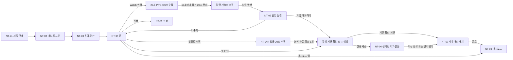
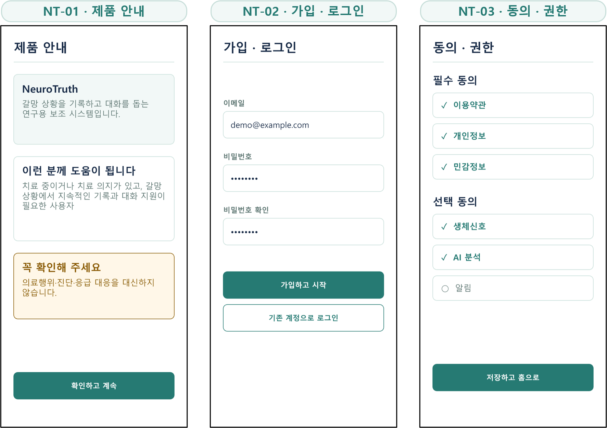
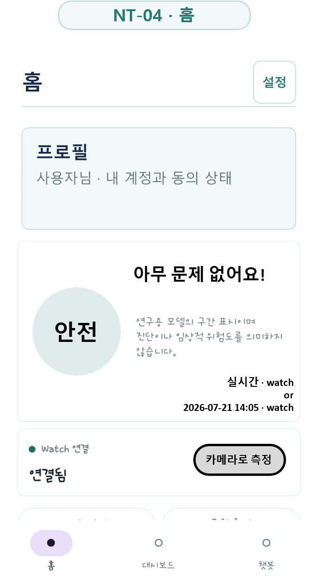
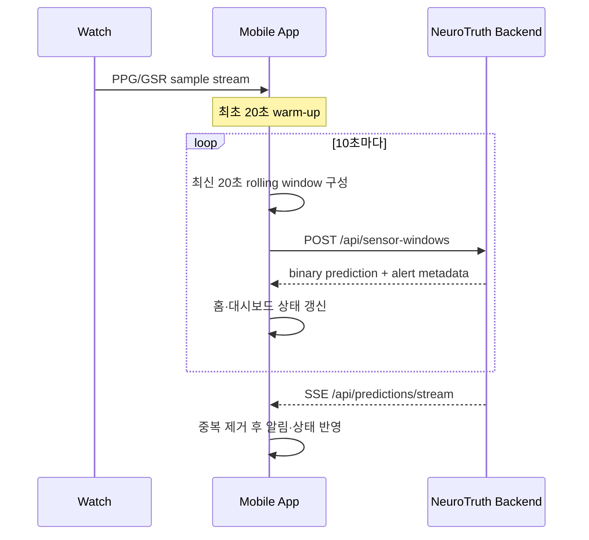
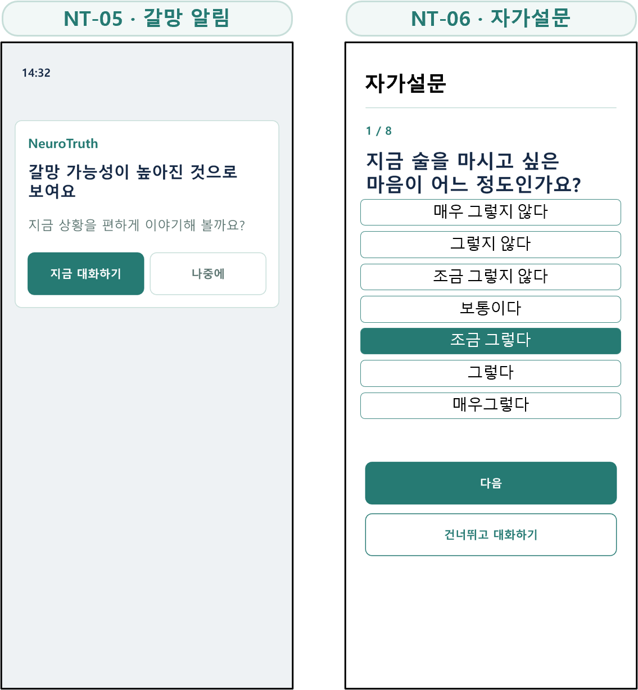
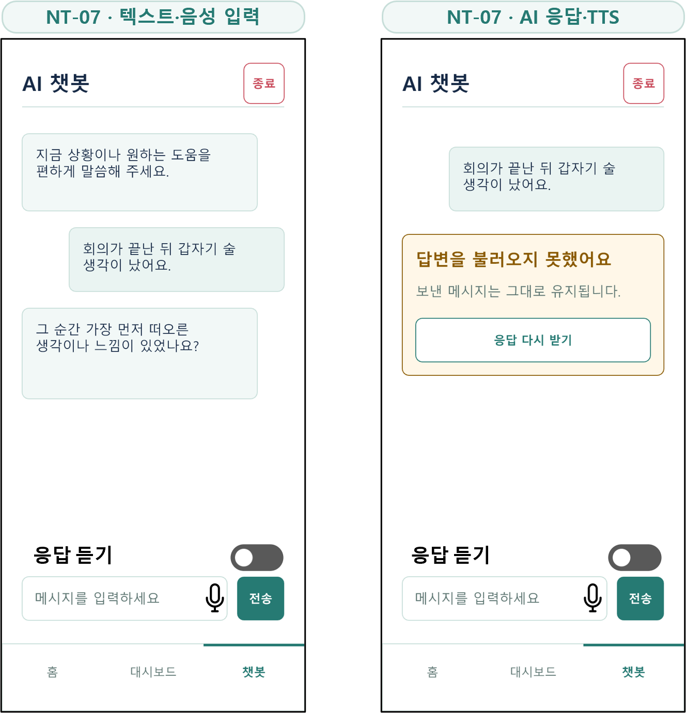
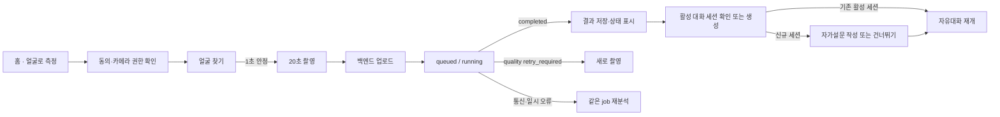
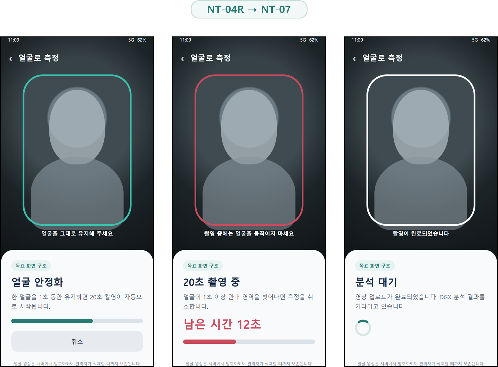
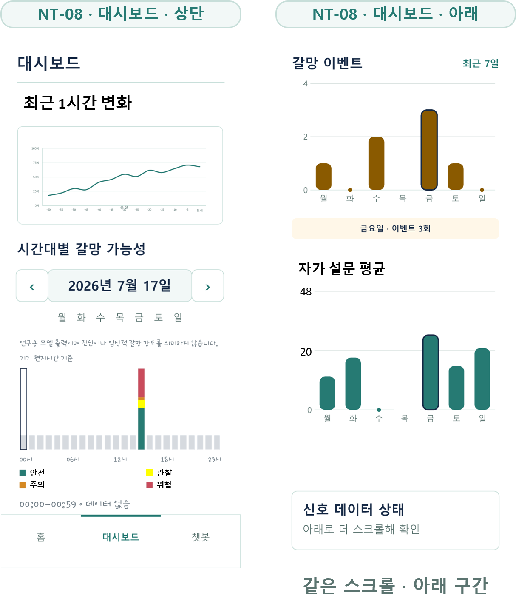
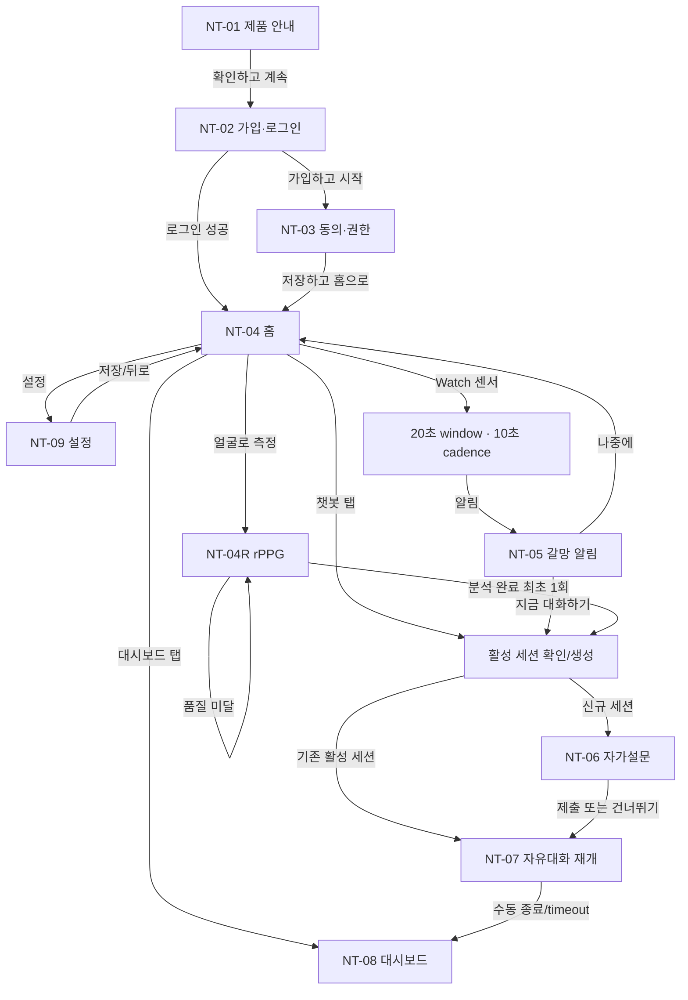

# NeuroTruth 신규 모바일 앱 프론트엔드 개발 요청 (V22 기준)

> 발표자료 [`handoff/neurotruth_app_design_handoff_v22.pptx`]의 개발자용 상세 부속 문서입니다. 
> 통신 세부 필드의 최종 기준은 [`../apps/test_mobile_app/SERVER_API_SPEC.md`]와 실행 중인 서버의 `/openapi.json`입니다.  

## 1. 사용자 흐름 시나리오 (전체)

앱은 치료 앱이 아니라, 생체신호와 사용자 기록을 바탕으로 갈망 상황에서 대화를 제안하는 **연구용 보조 시스템**입니다. 진단, 치료효과, 응급 대응을 보장하는 문구를 사용하지 않습니다.

### 하단 내비게이션

| 탭 | 기본 목적 | 유지 상태 |
|---|---|---|
| 홈 | 프로필 요약, 현재 갈망 상태, Watch 연결, 얼굴 측정 진입 | 마지막 갈망 상태와 Watch 상태 |
| 대시보드 | 최근 1시간·오늘·7일·30일 기록 확인 | 선택 날짜와 기간 |
| 챗봇 | 활성 대화 재개 또는 새 자유대화 시작 | 활성 `sessionId`, 미전송 입력문 |

프로필은 독립 하단 탭으로 만들지 않습니다. 계정과 동의 관리는 홈 우측 상단의 **설정**에서 진입합니다.
알림의 `지금 대화하기`, 홈의 `챗봇` 탭, rPPG 분석 완료는 모두 같은 세션 진입 함수를 사용합니다. 서버가 새 세션을 생성한 경우에만 **자가설문 작성 또는 건너뛰기**를 보여주고, 기존 활성 세션을 반환한 경우에는 자가설문을 다시 요구하지 않고 대화를 재개합니다.

## 2. 개발사항 요약 (화면 등장 순서 1~9)

| # | 개발사항          | 연결 (버튼 → 이동/반응)                                         | 기능 매핑 | 우선순위 |
|---:|---------------|---------------------------------------------------------|---|---|
| 1 | 제품 안내         | `[확인하고 계속]` → 가입·로그인                                    | 제품 고지 | P0 |
| 2 | 사용자 가입 정보·로그인 | `[가입하고 시작]` → 동의·권한, `[기존 계정으로 로그인]` → 홈                | 인증 | P0 |
| 3 | 동의·권한         | `[저장하고 홈으로]` → 가입 요청·홈, 선택 동의 OFF → 해당 기능만 비활성          | 동의·권한 | P0 |
| 4 | 홈             | Watch 연결 시 얼굴 측정은 미동작, 미연결 시 `[카메라로 측정]`을 주 동작으로 제공     | 상태 요약·측정 선택 | P0 |
| 5 | Watch·갈망 알림   | 연결 상태 표시, 센서 전송, `[지금 대화하기]` → 자가설문 선택, `[나중에]` → 현재 화면 | 센서·예측·알림 | P0 |
| 6 | 자가설문          | 8문항 작성 또는 `[건너뛰고 대화하기]` → 챗봇                            | 자기보고 | P1 |
| 7 | 자유대화·STT·TTS  | 마이크 → 편집 가능한 문장, `[전송]` → AI 응답, `[듣기/정지]`, `[종료]`      | 대화·음성 | P0 |
| 8 | 얼굴 영상 rPPG    | 얼굴 안정화 → 20초 촬영 → 업로드·분석 → 결과 저장 → 챗봇                   | 카메라·rPPG | P1 |
| 9 | 대시보드·설정       | 막대/선 선택 → 해당 기간의 간단한 상세, 날짜·기간 변경, 동의·권한·로그아웃           | 기록·계정 | P1 |

---

## 개발 1·2·3 — 제품 안내, 가입·로그인, 동의·권한

### 제품 안내

- 최초 실행 또는 안내 버전 변경 시 표시합니다.
- 다음 내용을 짧고 분명하게 보여줍니다.
  - CBT 치료 중이거나 치료 의지가 있는 사용자를 위한 연구용 보조 시스템
  - 갈망 상황 기록과 대화 지원 제공
  - 의료행위, 진단, 처방, 응급 대응을 대체하지 않음
- 사용자가 확인한 안내 버전은 기기에 저장하고 설정에서 다시 볼 수 있게 합니다.

### 가입·로그인

- 사용자가 직접 가입하고 로그인합니다.
- 신규 사용자는 NT-02에서 계정 정보를 입력한 뒤 NT-03으로 이동합니다. 이때 비밀번호 등 가입 정보는 화면 흐름 동안 메모리에만 유지합니다.
- NT-03에서 필수 동의를 확인한 뒤 `POST /api/auth/patient/signup`에 계정 정보와 consent snapshot을 함께 보내 가입을 완료합니다. 현재 서버는 signup 요청에 consent를 요구합니다.
- 기존 계정 로그인 완료 후에는 최신 동의 상태를 확인하고, 필수 동의가 충족되면 홈으로 이동합니다.
- access token 만료 시 refresh를 한 번 수행하고 원 요청을 한 번만 재시도합니다.
- refresh 실패 시 진행 중 녹음·TTS·polling·센서 업로드를 정리한 뒤 로그인 화면으로 이동합니다.

### 동의·권한

필수 동의는 이용약관, 개인정보, 민감정보입니다. 선택 기능은 각각 독립적으로 끌 수 있어야 합니다.

| 선택 동의 | 켜졌을 때 | 꺼졌을 때 |
|---|---|---|
| 생체신호 | Watch PPG/GSR 수집·전송 | Watch 측정 기능 비활성 |
| AI 분석 | 갈망 모델 추론 | 센서 저장만 가능, 갈망 결과 미표시 |
| 알림 | 갈망 알림·대화 제안 | 결과는 기록하되 알림 미표시 |
| 음성 | STT 입력 | 텍스트 입력만 제공 |
| 얼굴 rPPG | 얼굴 측정 기능 | `얼굴로 측정` 비활성 및 사유 안내 |
| 얼굴 영상 보존 | rPPG 영상 업로드·서버 보존 | 얼굴 측정 시작 차단 |

## 개발 4 — 홈

홈은 아래 세 영역만 우선 노출합니다.

1. **프로필 요약** — 사용자 표시명과 계정 요약, 우측 상단 설정 진입
2. **갈망 상태** — 최신 class-1 확률을 사용자용 문구로 표시하고 마지막 측정 시각과 출처를 함께 표시
3. **Watch 상태 및 카메라 측정** — 연결됨, 연결 안 됨, 확인 중, 오류를 구분하고 Watch 미연결·동의·권한·서비스 준비 조건이 모두 맞을 때만 카메라 측정을 활성화

홈에는 PPG 파형을 넣지 않습니다. 원시 신호와 상세 그래프는 대시보드에서 확인합니다.

### Watch 연결에 따른 측정 동작

| 상태 | 홈 동작                                                     |
|---|----------------------------------------------------------|
| Watch 연결됨 | Watch 모니터링을 기본 측정으로 유지하고 `[카메라로 측정]`버튼은 비활성화 합니다. |
| Watch 연결 안 됨 | rPPG 동의·카메라 권한·서버 준비가 충족되면 `[카메라로 측정]`을 주 동작으로 활성화합니다.   |
| Watch 확인 중·오류 | 미연결로 추정하지 않고 카메라 버튼을 비활성화한 채 상태 확인 안내를 표시합니다. |

- 갈망 상태 카드 우측 하단에는 **측정 시각과 측정 기기**를 함께 표시합니다.
- 실시간 Watch 값은 `실시간 · Watch`, 저장된 값은 `YYYY-MM-DD HH:mm · Watch|카메라` 형식으로 구분합니다.
- 홈의 최신 상태는 `timestampMs`로 비교합니다. 늦게 도착한 과거 카메라 결과가 더 최신인 Watch 결과를 덮어쓰지 않아야 하며, 동일 시각이면 Watch를 우선합니다.
- 카메라 결과 이력은 홈 최신 상태와 별개로 대시보드에 유지합니다.
- 일반 사용자 화면에 서버 상태, 원시 PPG, 권한 확인, 개발자 버튼을 노출하지 않습니다. 실제 기기 테스트 화면은 홈 프로필 헤더를 2.5초 길게 누르는 숨겨진 진입으로만 유지합니다.

### 갈망 가능성 표시 규칙

| 서버의 `cravingProbability` | 단계 | 사용자 표시 문장 |
|---:|----|---|
| `0.00 ≤ p < 0.25` | 안전 | 아무 문제 없어요! |
| `0.25 ≤ p < 0.50` | 관찰 | 관찰이 필요해요, 심각하진 않아요! |
| `0.50 ≤ p < 0.75` | 주의 | 주의가 필요해요, 술이 드시고 싶으신가요? |
| `0.75 ≤ p ≤ 1.00` | 심각 | 갈망이 심해보여요. 챗봇과 대화를 시작할까요? |

- 홈에서는 정확한 퍼센트를 크게 노출하지 않습니다.
- `recommend|required` 알림이 있으면 확률 문구와 별도로 **대화 권장**을 표시합니다.
- `안전 · 관찰 · 주의 · 심각`은 임상 위험도나 진단 cutoff가 아니라 연구 화면 표시 규칙입니다.
- 측정값이 없으면 임의의 0 또는 “낮음”을 표시하지 않고 **측정 데이터 없음**으로 표시합니다.

## 개발 5 — Watch 수집과 갈망 알림

Watch 연동은 다음 계약을 지킵니다.

### 센서 window

- `windowMs=20000`
- 첫 전송 전 20초 warm-up
- 이후 10초마다 최신 20초 window 전송
- PPG 채널별 500개(25Hz), EDA 20개(1Hz)
- 한 window의 재시도에는 같은 `clientWindowId`와 같은 payload를 사용합니다.
- Watch 미연결, 준비 중, 수집 중, 전송 실패를 서로 다른 상태로 표시합니다.

### 알림 화면

- 앱 내부 카드가 아니라 휴대폰 시스템 알림 또는 팝업처럼 표시합니다.
- 진단이나 확정 판정처럼 말하지 않습니다. 예: “갈망 가능성이 높아진 것으로 보여요. 지금 상황을 이야기해 볼까요?”
- `[지금 대화하기]` → 자가설문를 작성하거나 건너뛸 수 있는 흐름
- `[나중에]` → 세션을 만들지 않고 현재 화면으로 복귀
- 같은 `alertId`는 중복 알림을 만들지 않습니다.

## 개발 6 — 선택형 자가설문

자가설문는 8문항이며, 각 문항은 다음 7개 문장 선택지를 사용합니다. 화면에서는 숫자를 숨기고, API에는 다음 0-based 값을 전송합니다.

| API 값 | 화면 문구 |
|---:|---|
| 0 | 매우 그렇지 않다 |
| 1 | 그렇지 않다 |
| 2 | 조금 그렇지 않다 |
| 3 | 보통이다 |
| 4 | 조금 그렇다 |
| 5 | 그렇다 |
| 6 | 매우 그렇다 |

- 화면은 한 문항씩 진행하고 현재 번호 `1/8`을 표시합니다.
- `[건너뛰고 대화하기]`는 항상 제공하며, 건너뛰어도 챗봇을 차단하지 않습니다.
- 화면 선택값은 문항당 0~6, 사용자 표시 총점은 **0~48**입니다.
- 전송 계약은 `instrumentCode="AUQ"`, `version="2.0"`, 8개의 `responses`/`scoredItems`, `rawScore=0..48`, `scaleMin=0`, `scaleMax=48`입니다.
- 임의의 낮음·중간·높음 cutoff는 만들지 않습니다.
- 설명은 “점수가 높을수록 당시 음주 욕구 관련 응답이 높았습니다” 수준으로 제한합니다.

## 개발 7 — 자유대화, STT, TTS

### 기본 대화

- 대화는 “지금 상황이나 원하는 도움을 편하게 말씀해 주세요.”라는 중립 안내로 시작합니다.
- 사용자가 직접 입력한 텍스트와 STT로 확인한 문장은 동일한 자유대화 흐름으로 처리합니다.
- 한 AI 응답에 질문은 최대 하나이며, 질문 없이 공감·반영·도움을 제안하는 응답도 허용합니다.
- 고정 문진, 슬롯 진행률, 의무 질문 순서는 화면에 두지 않습니다.
- 사용자가 이미 답했거나 거부한 내용을 반복해서 묻지 않습니다.
- 수동 종료와 1시간 inactivity timeout을 지원합니다.

### 메시지 전송과 재시도

1. 전송 직전에 `clientMessageId` UUID를 생성합니다.
2. 전송 중에는 같은 메시지의 중복 전송을 막습니다.
3. AI provider 실패 시 사용자 말풍선은 그대로 유지하고 **응답 다시 받기**를 표시합니다.
4. 재시도는 같은 ID, 같은 본문, 같은 `inputModality`로 한 번만 수행합니다.
5. 사용자가 본문을 수정하면 새 메시지로 보고 새 ID를 생성합니다.

### STT

- 마이크를 눌러 녹음을 시작·종료하며 최대 30초입니다.
- 서버가 반환한 transcript를 입력창에 넣고 사용자가 편집·확인하게 합니다.
- transcript를 자동으로 전송하지 않습니다.
- 음성 동의나 권한이 없거나 STT가 실패해도 텍스트 입력은 계속 사용할 수 있어야 합니다.
- 원본 음성 임시 파일은 업로드 종료, 취소, 화면 이탈 시 삭제합니다.

### TTS

- 서버 TTS가 아니라 기기의 음성 합성 기능을 사용합니다.
- AI 말풍선마다 `[듣기]`와 `[정지]`를 제공합니다.
- 동시에 한 응답만 재생하며, 다른 응답 재생·화면 이탈·로그아웃 시 기존 재생을 중지합니다.
- 전체 자동 읽기는 기본 OFF입니다.
- TTS 사용 불가 또는 실패 시 텍스트 답변은 그대로 유지합니다.

## 개발 8 — 얼굴 영상 rPPG와 챗봇 연결

홈 갈망 카드의 `[카메라로 측정]`에서 시작합니다. Watch 연결 중에는 카메라 버튼을 비활성화하고, Watch가 명확히 미연결이며 동의·권한·rPPG 서비스가 모두 준비된 경우에만 대체 측정 동작으로 활성화합니다. 앱은 DGX 주소를 직접 호출하거나 노출하지 않고 NeuroTruth 백엔드만 호출합니다.

### 촬영 상태

`준비 → 얼굴 찾기 → 안정화 → 20초 촬영 → 업로드 → 분석 대기 → 완료/재촬영/실패`

- 전면 카메라를 사용합니다.
- 한 얼굴이 안내 영역에서 1초 유지되면 자동 촬영합니다.
- 촬영 중 얼굴이 1초 이상 사라지거나 앱이 background로 이동하면 취소합니다.
- 영상은 MP4, `durationMs=19500..20500` 계약을 사용합니다.
- 진입 전 `GET /api/rppg/status`의 `enabled`, `available`, `modelLoaded`를 확인하고 세 값이 준비된 경우에만 화면의 `ready` 상태로 해석합니다.
- HTTP 202 이후에는 로컬 MP4를 삭제하고 `jobId`, `captureId`, `clientCaptureId`만 복구용으로 저장합니다.
- 앱 재시작 후 terminal 상태가 아니라면 polling을 재개합니다.
- `retry_required` 품질 미달은 같은 job 재시도가 아니라 **새 촬영**입니다.
- `failed`이면서 `retryAllowed=true`인 통신·timeout 계열만 재분석 API를 사용합니다.
- 완료 이벤트를 여러 번 받아도 챗봇 세션 생성과 화면 이동은 한 번만 수행합니다.
- rPPG 완료를 job당 한 번만 처리합니다. 기존 활성 세션이 있으면 자가설문 없이 대화를 재개하고, 신규 세션을 만들었다면 자가설문 작성 또는 건너뛰기 후 대화로 이동합니다.
- rPPG 결과는 DB와 대시보드 이력에 유지합니다. 이후 Watch prediction이 도착하면 홈의 최신 상태만 Watch 결과로 교체합니다.

## 개발 9 — 대시보드와 설정

### 대시보드 구성

| 영역          | 기본 기간 | 표현 | 빈 데이터 처리 |
|-------------|---|---|---|
| 최근 갈망 변화    | 최근 1시간 | 0~100% 선 그래프, 10초 bucket, 최대 360점 | 선을 연결하지 않고 공백 |
| 시간대별 갈망 가능성 | 오늘 24시간 | 4단계 중첩 막대 | 회색 빈 막대 |
| 갈망 이벤트      | 최근 7일, 30일 | 일별 `recommend\|required` 발생 건수 | prediction 없음=데이터 없음, prediction 있음·알림 없음=0건 |
| 자가설문(자가설문)  | 오늘, 7일, 30일 | 오늘은 시간별, 나머지는 일별 0~48 평균 | 응답 없음=데이터 없음 |
| PPG         | 실시간·선택 prediction | Watch 실시간 신호와 최대 512점 preview | 연결/자료 없음 문구 |

환자 대시보드에서는 상태 추론 카드와 리포트 상태 카드를 렌더링하지 않습니다. 백엔드의 기존 생성·저장·조회 계약은 호환성을 위해 유지합니다.

#### 최근 1시간 그래프

- class-1 softmax를 0~100%로 표시합니다.
- smoothing이나 누락 구간 보간을 하지 않습니다.
- 실제 표본이 있는 시각만 점으로 표시하고, 연속된 데이터 사이에서만 선을 연결합니다.
- 최신 값과 그래프 끝점이 같은 시각을 가리켜야 합니다.
- `GET /api/me/craving-probability-series?range=1h`를 사용합니다. 최근 60분을 10초 bucket으로 최대 360점 받으며, 24시간 데이터를 잘라 대체하지 않습니다.

#### 오늘 24시간 중첩 막대

각 시간 막대는 해당 시간에 들어온 예측을 다음 네 단계의 비율로 쌓아 표시합니다.

- 안전
- 관찰
- 주의
- 심각

막대를 누르면 시간, 표본 수, 단계별 비율을 간단한 상세 카드로 보여줍니다. 표본이 하나도 없는 시간을 0%로 오인시키지 않습니다.

#### 갈망 이벤트

- 막대를 누르면 날짜와 발생 횟수를 보여줍니다.
- prediction 자체가 없으면 빈 구간으로, prediction은 있었지만 이벤트가 없으면 유효한 `0건`으로 표시합니다.

#### 자가설문(자가설문)

- UI 기준은 0~48점입니다.
- 막대를 누르면 `평균 X/48`, 응답 횟수, 기간을 간단한 상세 카드로 보여줍니다.
- 집계 API의 `averageScore` 0~48 값을 우선 사용합니다. 동시 배포 전환 중에 해당 필드가 없는 응답에서만 호환용 `averageNormalizedScore × 48`로 대체합니다.

### 설정

- 계정 정보
- 필수·선택 동의 상태 및 변경
- 제품 안내 다시 보기
- 알림·마이크·카메라 등 기기 권한 상태
- 로그아웃

로그아웃 시 SSE, Watch 업로드, rPPG polling, 녹음, TTS를 모두 정리하고 사용자별 화면 캐시를 삭제합니다.

---

## 3. 연결 파이프라인 (버튼 → 목적지 전체)

## 4. 화면별 상태 정의

| 화면    | 기본 | 로딩/진행 | 빈 데이터 | 오류 | 복구/재시도 |
|-------|---|---|---|---|---|
| 홈     | 프로필·갈망·Watch | 사용자/상태 조회 중 | 측정 데이터 없음 | 서버 연결 실패 | 새로고침, 로그인 복구 |
| Watch | 연결됨/수집 중 | 20초 warm-up, 업로드 중 | 연결 안 됨 | 권한·통신 오류 | 다시 연결, 같은 window 재전송 |
| 알림    | 지금 대화/나중에 | 세션 확인 중 | 해당 없음 | 세션 생성 실패 | 다시 시도 또는 홈 |
| 자가설문  | 문항·7개 선택지 | 제출 중 | 해당 없음 | 제출 결과 불명확 | 상태 확인 후 재제출 정책 적용 |
| 챗봇    | 입력 가능 | 전송·STT·TTS | 대화 시작 안내 | AI 응답 실패 | 같은 메시지로 1회 재시도 |
| rPPG  | 촬영 준비 | 안정화·촬영·업로드·분석 | 해당 없음 | 품질/통신/권한 오류 | 새 촬영 또는 허용된 job 재분석 |
| 대시보드  | 그래프·상세 | 기간 집계 중 | 회색 빈 구간 | 조회 실패 | 같은 조건으로 새로고침 |
| 설정    | 현재 상태 | 저장 중 | 해당 없음 | 저장 실패 | 변경값 보존 후 재시도 |

## 5. API·이벤트 정합 전체 맵

| 항목                | 프런트 화면/동작 | API·이벤트 | 현재 상태                                    |
|-------------------|---|---|------------------------------------------|
| 가입                | NT-02·NT-03 | `POST /api/auth/patient/signup` | consent snapshot을 포함해 사용 가능              |
| 로그인·갱신·로그아웃       | NT-02·NT-09 | `POST /api/auth/login`, `/refresh`, `/logout` | 사용 가능                                    |
| 내 정보              | NT-04·NT-09 | `GET/PATCH /api/me` | 사용 가능                                    |
| 동의                | NT-03·NT-09 | `POST /api/me/consents` | 사용 가능                                    |
| 센서 window         | NT-04 | `POST /api/sensor-windows` | 20초 window 계약 사용 가능                      |
| 실시간 prediction    | NT-04·NT-08 | `GET /api/predictions/stream` (SSE) | Watch 결과는 `source=watch_sensor`; 카메라는 `source=camera_rppg` |
| 세션 시작·복원          | NT-05·NT-07·NT-04R | `POST /api/sessions`, `GET /api/sessions/{id}` | 신규 세션은 자가설문 선택 후 대화, 기존 활성 세션은 바로 재개 |
| 메시지               | NT-07 | `POST /api/sessions/{id}/messages` | `clientMessageId`, `inputModality` 사용 가능 |
| 자가설문(AUQ)        | NT-06 | `POST /api/sessions/{id}/assessments` | `version=2.0`, 8개 0~6, 총점 0~48 |
| 세션 종료             | NT-07 | `POST /api/sessions/{id}/finish` | 사용 가능                                    |
| STT 상태·인식         | NT-07 | `GET /api/stt/status`, `POST /api/sessions/{id}/transcriptions` | 사용 가능, 서버 unavailable 시 텍스트 유지           |
| TTS               | NT-07 | 기기 로컬 음성 합성 | 서버 API 없음                                |
| 통합 대시보드           | NT-08 | `GET /api/me/craving-dashboard` | 사용 가능                                    |
| 확률 시계열            | NT-08 | `GET /api/me/craving-probability-series?range=1h` | 10초 bucket, 최대 360점, 누락 구간 미생성 |
| PPG preview       | NT-08 | `GET /api/me/predictions/{predictionId}/ppg-preview` | 사용 가능                                    |
| rPPG 상태·생성·조회·재시도 | NT-04R | `GET /api/rppg/status`, `POST /api/rppg/jobs`, `GET /api/rppg/jobs/{id}`, `POST /api/rppg/jobs/{id}/retry` | 완료 job은 한 번만 prediction 반영 후 동일 세션/AUQ 경로로 이동 |

### 공통 오류 UX

| 상태 | 사용자 동작 |
|---:|---|
| 401 | token 갱신 1회 → 실패 시 로그인 |
| 403 | 필요한 동의·권한 안내 → 설정 이동 |
| 409 | 중복 ID·세션 상태를 확인하고 자동 새 ID 생성 금지 |
| 413/415/422 | 파일 크기·형식·입력 내용을 사용자가 수정할 수 있게 안내 |
| 502 | 챗봇의 동일 메시지 응답을 수동으로 1회 재시도 |
| 503 | 기능을 잠시 사용할 수 없음을 표시하고 다른 기능은 유지 |
| 504 | STT 또는 외부 분석 timeout 안내와 재시도 선택 제공 |

오류 화면에 내부 서버 주소, 모델 경로, credential, stack trace를 표시하지 않습니다.

## 6. 로컬 상태·복구 규칙

| 데이터 | 저장 목적 | 정리 시점 |
|---|---|---|
| 로그인 token | 인증 유지 | 로그아웃·갱신 실패 |
| 제품 안내 확인 버전 | 최초 안내 반복 방지 | 버전 변경 시 갱신 |
| 활성 `sessionId` | 앱 재시작 후 대화 재개 | 종료·timeout·로그아웃 |
| pending `clientMessageId`와 요청 | 챗봇 재시도 중복 방지 | 성공·재시도 소진·로그아웃 |
| rPPG `jobId`, `captureId`, `clientCaptureId` | polling 복구 | terminal 처리·로그아웃 |
| rPPG 완료 화면 이동 여부 | 챗봇 중복 이동 방지 | 완료 처리 후 정리 |
| STT 음성 파일 | 일시 업로드 | 성공·실패·취소·화면 이탈 즉시 삭제 |
| rPPG MP4 | 202 이전 수동 재업로드 | HTTP 202 직후 삭제 |
| 대시보드 캐시 | 화면 복원 | 사용자 전환·로그아웃 |

비밀번호, API key, DGX 내부 주소, 음성 원본, 202 이후 얼굴 영상을 앱의 일반 저장소에 보존하지 않습니다.

## 7. 구현 우선순위와 인수 기준

### P0 — 데모 필수

- 제품 안내, 가입·로그인, 필수 동의
- 홈의 프로필·갈망 가능성·Watch 상태
- 하단 `홈 · 대시보드 · 챗봇`
- Watch 20초 warm-up, 10초 cadence, 센서 업로드
- 갈망 알림의 `지금 대화하기 / 나중에`
- 자유대화, 같은 메시지 재시도, 수동 종료
- 텍스트 입력, STT transcript 편집, 기기 TTS
- 최신 상태와 기본 대시보드 조회

### P1 — 통합 완성

- 8문항·7점 문장형 자가설문과 건너뛰기
- 얼굴 20초 rPPG 촬영·job 복구·완료 후 챗봇 이동
- 오늘 24시간 중첩 막대, 이벤트, 자가설문, PPG preview
- 설정의 선택 동의·권한·로그아웃
- process 종료 후 세션·rPPG polling 복구

### 인수 시나리오

1. 신규 사용자가 안내 확인 → 가입 → 동의 → 홈까지 이동한다.
2. Watch 연결 후 20초를 수집하고 이후 10초마다 prediction이 갱신된다.
3. 알림에서 자가설문를 작성하거나 건너뛴 뒤 같은 자유대화로 진입한다.
4. 텍스트와 STT 입력이 모두 전송되고 AI 응답을 텍스트와 TTS로 확인한다.
5. AI 실패 시 사용자 메시지가 중복되지 않은 채 한 번 재시도된다.
6. 얼굴을 1초 안정화하고 20초 촬영한 뒤 분석 완료 시 챗봇으로 이동한다.
7. 앱을 재시작해도 활성 대화와 rPPG job을 중복 생성하지 않고 복구한다.
8. 대시보드에서 데이터 없음과 유효한 0건을 구분한다.
9. 로그아웃 시 SSE, 센서, 녹음, TTS, polling과 사용자 캐시가 정리된다.

## 8. PPT V22 화면·파이프라인 매핑

| PPT 페이지 | 개발 기준 |
|---:|---|
| 1 | NT-01~NT-08 전체 사용자 흐름과 하단 3탭 |
| 2 | 제품 안내 → 가입·로그인 → 동의·권한 |
| 3 | 홈 3개 영역, 선택형 Watch/카메라 측정, 측정 시각·기기 |
| 4 | 갈망 알림 → 자가설문 작성 또는 건너뛰기 → 챗봇 |
| 5 | 텍스트·STT 입력과 기기 TTS를 같은 대화에서 제공 |
| 6 | 최근 1시간, 시간대별 단계, 이벤트, 자가설문 대시보드 |
| 7 | 얼굴 안정화·20초 rPPG·결과 저장·챗봇 이동 |
| 8 | 최초 진입과 홈 측정 분기 |
| 9 | 알림·자가설문·대화 결정 흐름 |
| 10 | 텍스트와 음성을 하나의 확정 메시지 경로로 저장 |
| 11 | rPPG 성공·품질 미달·통신 실패와 챗봇 연결 |
| 13~17 | 실제 구현 화면 참고; 동작·문구 충돌 시 이 Markdown 계약 우선 |
